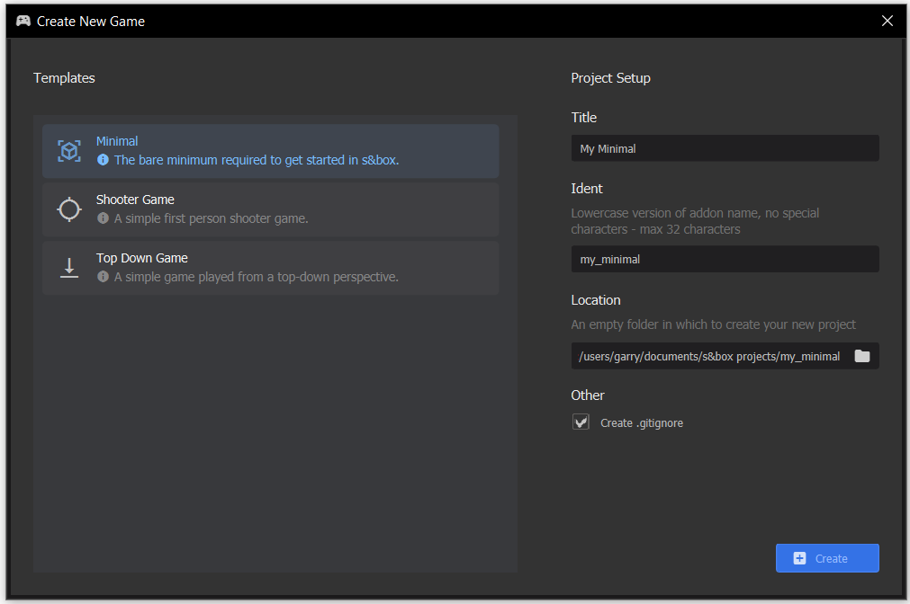

# Development

Creating a game in s&box is easy, but you probably want to know how to do things in the right order.

# Creating a project

The first step is to create a game project. Open the s&box Game Editor and the project window will appear. Simply click on **New Game Project** and fill out the wizard.

 

# The Scene System

We use a scene system to create our games in s&box. We feel this is the easiest system for people to pick up, while still being powerful.

### Scenes

A **Scene** is your game world. Everything that renders and updates in your game at one time should be in a scene. Scenes can be saved and loaded to disk.

### GameObject

A scene contains multiple **GameObjects**. The GameObject is a world object which has a position, rotation and scale. They can be arranged in a hierarchy, so that children GameObjects move relative to their parents.

### Component

GameObjects can contain Components. A component provides modular functionality to a GameObject. For example, a GameObject might have a ModelRender component - which would render a model. It might also have a BoxCollider component - which would make it solid.

The game developer ultimately creates games by programming new Components and configuring scenes with GameObjects and Components.

[Prickly Pete running around with a knife 2346x1134](./images/685170b0-123f-477e-bcb7-bf049f9b43ea.png)
