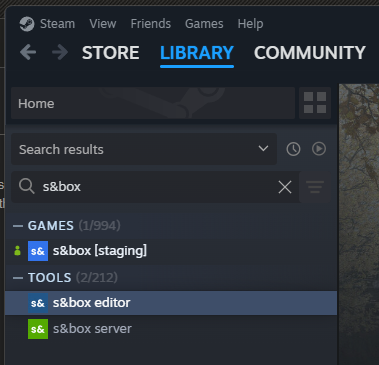
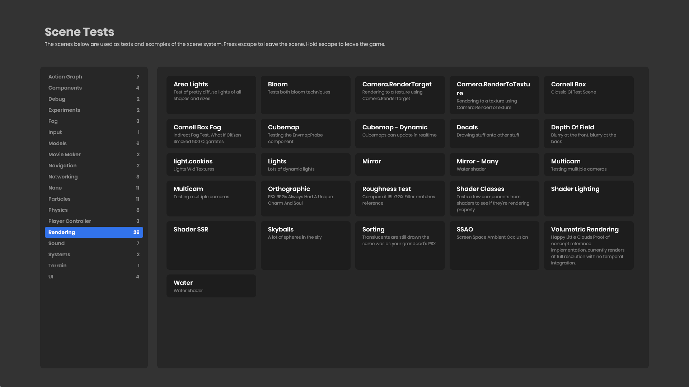

# First Steps

An engine can seem huge and complicated when you don't know it. The s&box engine is relatively simple.

Here's how we think you should get started exploring the engine.

### Getting the s&box editor 

The s&box editor and game are avaliable to everyone through the developer preview, you can obtain it [here](https://sbox.game/give-me-that).

To install the s&box editor [click here](steam://run/2129370) or:

1. Open Steam
2. Click on the Library tab
3. Search for s&box
4. Install both the game and the editor apps

You can either launch through Steam, use a shortcut to sbox-dev.exe or open your .sbproj flle directly.

# Play Testbed

Start s&box (not the editor) and find the game called `testbed`, this game is used by us to exhibit and test certain engine features, to make sure they work and keep working.

 When you enter the game you'll find a menu of scenes. Each scene tests a different engine feature. 

Click a scene to enter it, have a play around, press escape to return to the main menu. You can hold escape to completely leave any game.

:::success
So here's what you just saw. The menu uses our UI system, which is like HTML with c# inside. It's basically blazor, if you've ever heard of that.

When you clicked on a title, you entered a Scene. Our engine is Scene based, rather than map based like the regular Source Engine. Scenes are json files on disk, and are very fast to load and switch between - just like you experienced.\n\nYou probably saw a bunch of cool stuff. Here's some else cool, you can [download the source for that game here](https://github.com/Facepunch/sbox-scenestaging), which includes all the scenes. Once you download it just open the .sbproj file to open it in the s&box editor, then explore the different scenes in the Asset Browser.\n\nYou can edit the scenes and play with them locally to get a feel of how things work.

:::

# Create a New Project

The best way to learn is to do. Open the s&box editor and on the welcome screen, choose New Project. Create a Minimal Game project.

### Creating Game Objects

Once open you have an empty scene.  You can experiment by creating GameObjects by right clicking the tree on the left, and selecting an object type to create.

### Creating Components

After that, try to **make a GameObject** that you can control by creating a custom component by selecting **Add Component** on the GameObject inspector and typing in a name. The file should open in Visual Studio.

### Player Input

Use the [Input section of this site](/systems/input/index.md) to figure out how to read keys, and change the `WorldPosition` depending on which keys are being pressed.

After that, maybe control the position of the camera too, either by parenting it to your object, or by setting the position directly using `Scene.Camera.WorldPosition`.

:::success
Congratulations - you just learned the basics of GameObjects and Components. You're a game developer now.

:::

# Ask questions

If you don't understand something, [please ask on the forums](https://sbox.game/f) or on [Discord in the beginner's channel](https://discord.gg/sbox).

The more you ask questions, the more we'll realise that something is confusing, and the more likely we'll be to create documentation or make it simpler.

We can only know if we're doing something shit if you tell us. Please tell us what we're doing wrong.
