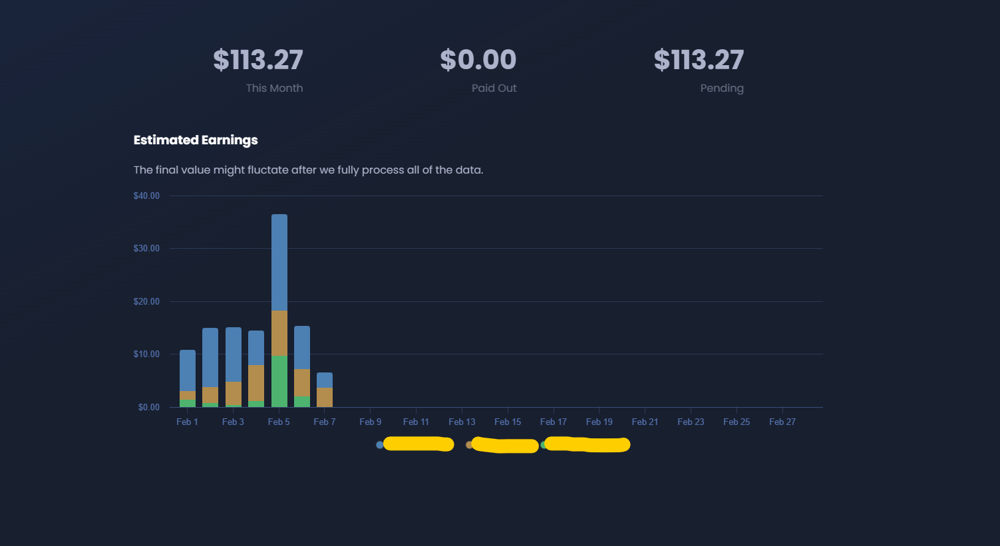

# Monetization

An important part of s&box being a modern game platform is allowing the developers that use it to make money from it. 

:::info
Our plans around monetization are evolving over time, nothing is set in stone. We want to give developers all the opportunities to make money possible without harming player experience. 

:::

# The Play Fund

Every day we create a pool of money. That pool is distributed among the games and maps with the most players.

### What is it, like most players? Most hours?

It's based roughly on clamped individual player hours. The exact algorithm we use is kept secret. We will need tweak the algorithm over time to encourage and discourage specific behaviours.

### How do I enable it?

Open your map or game package on sbox.game and go to `Configure > Edit Features`. You'll then see an option to include it.

### How do I know how much money I made?

The daily estimates are visible on your Organization's Page, under `Monetization`.

 

### Am I allowed to enable it for my Package? What are the rules?

If you're using copyrighted material in your package - then **no**. If you're repackaging someone else's work with no real creativity of your own, then **no**. 

If you're using stuff from sbox.game where author permission is implicit, stuff you created, stuff with an open license, then yes. 

### When are payments made?

Payments are made towards the middle of every month, for the previous month. For example, in the middle of March we'll pay out what you made in February.

You will need to have at least $100 pending to receive a payment. You also need to have set up your payment information in your profile settings.

### Can I subdivide payments to my team?

Yes! You can split your payments between your different team members. 

They don't need to be members of the organization.

### Is it just maps and games?

Yes, for now. It would be awesome for a map creator to be able to say "okay I used these models so I'm gonna give this org 10%", but if we do that it's something that will come later. This is the first step.

### Where's the pool from? How much is it?

I'd like to get more transparent about the pool in the future and show the figure somewhere. For now, while we're finding out feet, it's not public. 

Garry's Mod's revenue is funding the development of s&box. So the fund is from Garry's Mod for now. Our hope is that one day s&box will be able to stand on its own two feet, and the fund will grow with its success.
