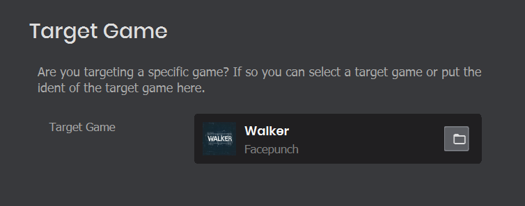
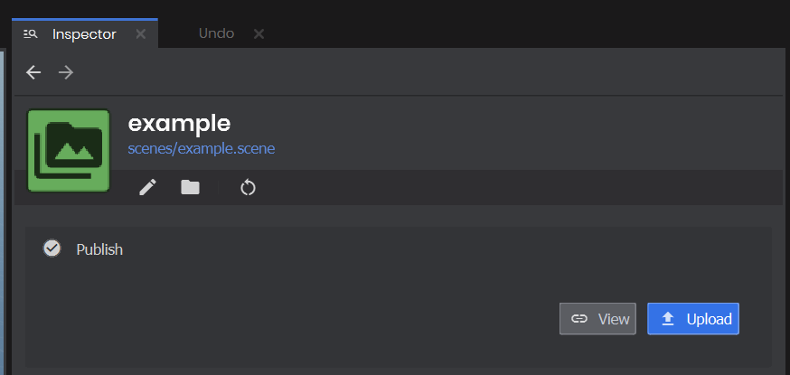

# Addon Project

An addon project adds to a Game Project. The addon project isn't published directly, you create assets and publish those individually.

The general idea is that you are able to use the components and assets from a target game to create assets for that game. The asset could be a map, a model, a material or even a custom resource defined by that game.

:::info
You can't make addon projects that contain code yet - but you can use actiongraph

:::

## Game Target

In the project settings you're able to select the target game. If you change this game then you must restart the editor for the changes to apply.

 

## Publishing

To publish something made in an Addon Project, you would find it in the asset browser and publish it from there.

 

From there your map, or model, or whatever will get its own page on sbox.game, and you will be able to configure it.
