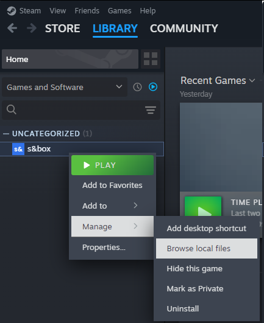
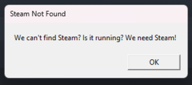
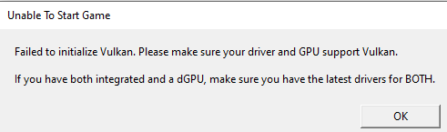

# Reporting Errors

Errors will happen. Here's how to make a useful error report.

# Issue Tracker

We use github to track issues. [Our issue repository is here](https://github.com/Facepunch/sbox-issues/issues). When issues are submitted, they're triaged and assigned [priorities on our project here](https://github.com/orgs/Facepunch/projects/24).

# Error Logs

It's often really helpful to us to have your log to work out what's going on. If you get any errors, these will be printed in the log file along with their stack trace, and any other messages.

They're written to the `logs` folder inside your s&box installation directory, the quickest way to get to this is by right-clicking s&box in Steam.

 

The last 10 are kept, the latest one is always called `Log.log`. Find the right one for the session and attach this to your issue on GitHub.

:::warning
An error message on its own is usually not very useful. If you can provide a stack trace too, by either uploading the log or copy/pasting from the console (by clicking the error in the in-game console), it'll make things much easier to diagnose.

Please **don't** upload screenshots of the console, they aren't useful.

:::

# Hard Crashes

When you get a hard crash (the game or editor exits on its own) then the crash log is generally automatically generated and uploaded to our backend.

While these crash logs are useful in revealing the problem, sometimes it's not obvious. If you have found a way to reproduce the crash, that's really useful, please make an issue. If the crash needs a specific asset to cause the crash, please provide that too.

Finally, please provide your 64-bit steamid (steamID64); this lets us look up your crash dumps very easily. You can use websites [like](https://steamid.io/) [these](https://www.steamidfinder.com/) to find it.

# Common Errors

You NEED the following, if you don't have the following this is likely why:

* Windows 10 and above - Windows 7 will not work
* At least 4GB of RAM, 8GB for the editor.
* A graphics card that isn't older than 12 years

### Steam Not Found

 

This tends to happen when you've got a Steam emulator on your system from pirating games, naughty.

### Failed to initialize Vulkan

 

Graphics cards have supported Vulkan since 2012. If you don't have one, get one.

If you are on a laptop, make sure your drivers are up to date for your integrated and dedicated graphics.

### Proton Errors

If something is working on Windows but doesn't work on Proton, tell the Proton team

<https://github.com/ValveSoftware/Proton/issues/4940>
