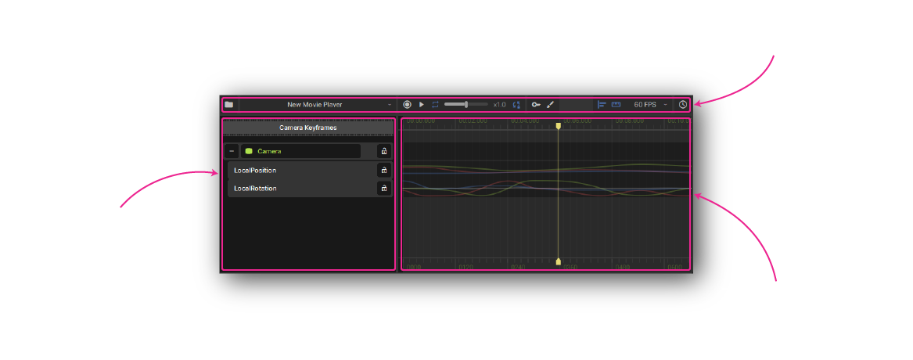
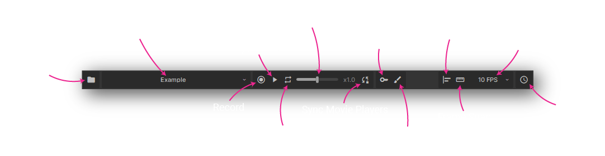
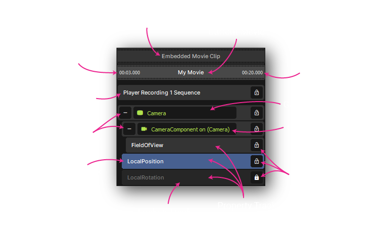
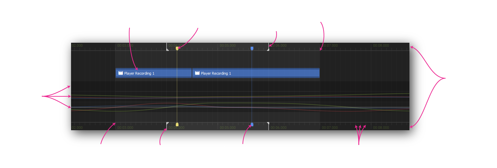

# Editor Map

# Toolbar

## Project

### File Menu

Create, open, or import movies.

### Movie Player Selection

Select a or create a movie player in the current scene.

### History

Toggle a panel to show modification history, so you can undo / redo changes.

## Playback

### Record

Toggle recording changes from the scene into the timeline.

### Play / Pause

Toggle playback of your movie.

### Repeat

Toggle looping for when playback reaches the end of the movie.

### Playback Speed

Controls both playback and recording rate.

### Sync Movie Players

Toggle synchronizing all movie players in the scene when previewing playback.

## Edit Modes

### Keyframe Editor

Switch to the keyframe editor mode, for simpler animations. Find out more [here](/animation/movie-maker/keyframe-editing.md).

### Motion Editor

Switch to the motion editor mode, for finer control than keyframe editing. Find out more [here](/animation/movie-maker/motion-editing.md).

## Snapping

### Object Snap

Snap to objects in the timeline when dragging.

### Frame Snap

Snap to the current frame rate when dragging.

### Frame Rate

Resolution to use when frame snapping.

# Track List

## Project Navigation

### Parent Movie

Name of the outer movie, when editing a sequence.

### Current Movie

Name of the currently opened movie resource.

### Sequence Start / End

Block of time referenced by an outer movie, when editing a sequence.

## Track Types

### Game Object Track

Gets bound to an object in the scene to be controlled during playback. Contains component and property tracks.

### Component Track

Gets bound to a component in the scene, defaults to a matching component of the parent game object track. Contains property tracks.

### Property Track

Named property within the parent track, describes how that property should change over time. Can contain nested property tracks.

### Sequence Track

Contains time blocks from another movie, making it easier to organize and edit complex projects.

## Track Controls

### Expand / Collapse

Show or hide nested tracks.

### Lock / Unlock

Toggle lock state of a track.

### Selected Track

Selecting a track will show relevant gizmos in the scene view.

### Locked Track

Disables modifications of this track in the movie.

# Timeline

* **Shift** - smoothly preview the time under the mouse
* **Scroll** - vertically scroll through track list
* **Shift+Scroll** or **Middle-Click+Drag** - pan horizontally
* **Ctrl+Scroll** - zoom in / out
* **Alt+Scroll** - scrub forwards / backwards by a frame

  \

## Regions

### Scrub Bar

Displays time labels. Click and drag to move the playhead.

### Tracks

Describe how properties change over time. Edited in either the keyframe or motion editor.

### Sequence Block

References a time block from another movie, nested in this one.

### Sequence Start / End

Start and end time of the currently edited sequence block, nested in another movie.

## Markers

### Playhead Marker

Currently selected time for editing.

### Preview Marker

Current time being previewed by holding shift and mousing over the timeline.

### Frame Tick

Based on the current frame rate, frame snapping will snap to these.

### Loop Start / End

Time range to loop when previewing playback. Set with alt+click+drag on a scrub bar.
