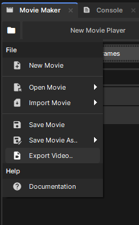
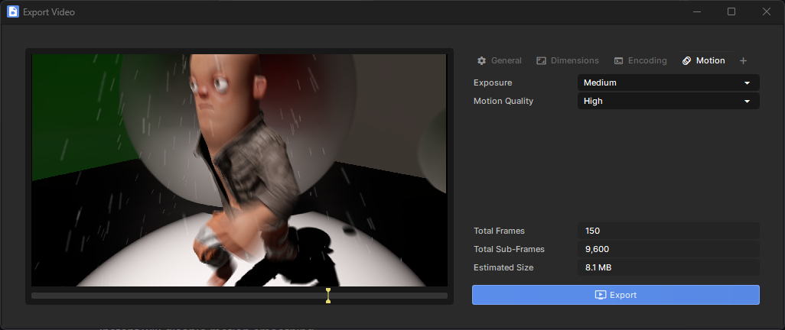
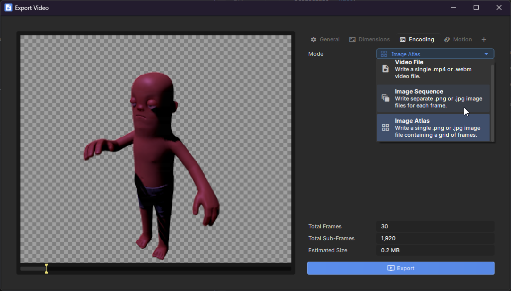

# Exporting Video

The currently open movie can be exported to a video file using the *Export Video..* option in the file menu. This will open a window that lets you tweak the output path, resolution, format, and quality of the exported video.

## Camera Control

The video will be rendered from the perspective of any active camera in the scene. You should therefore control camera motion using tracks in your movie project. You can also use tracks to toggle which cameras are enabled in the scene, if necessary.

## Motion Settings

When exporting, you can optionally enable motion smoothing at various strengths and quality levels. When enabled, each final exported frame will be made out of many sub-frames with a very small time step between them. This simulates having the camera's photosensor be exposed for a non-zero amount of time for each frame.

### Exposure

This controls what fraction time for each frame the sensor is exposed for. *Very Fast* will expose the sensor for 1/12th of a frame, *Medium* is ½, and *Very Slow* makes the sensor always exposed for very blurry motion. *Instant* will disable motion smoothing.

### Motion Quality

Use this to control how many sub-frames are rendered for every final output frame. This will greatly affect how long it takes to render your project, so you can set this to *Low* when previewing an export to save a lot of time.

## Image Sequence / Atlas

You can also export individual images for each frame of your video, or a single atlas with a tile for each frame. You can find these options in the Encoding tab.

Exported images can be JPEG or PNG, with PNG supporting transparent backgrounds.

:::tip
The background will be transparent if you have no skybox, and the camera's clear colour has 0 alpha.

:::
