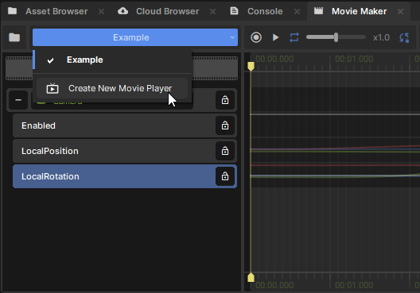
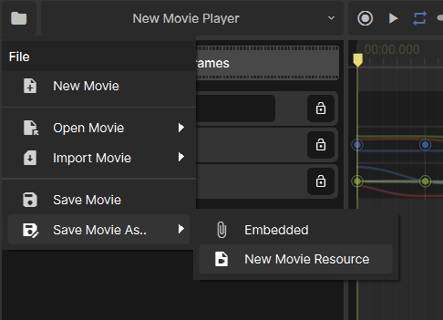
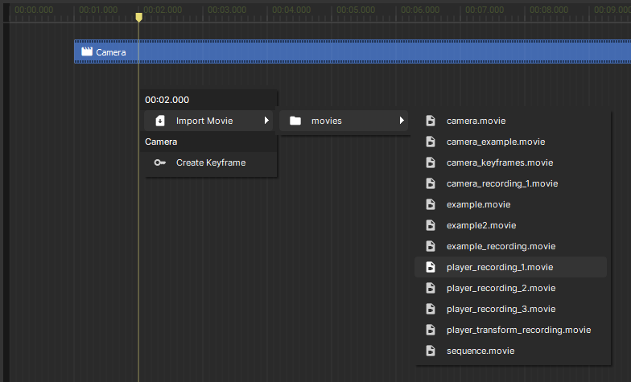

# Getting Started

In this article you'll find out:

* [How to open the Movie Maker editor](#h-movie-editor)
* [What is a Movie Player](#h-movie-player)
* [What is a Movie Resource](#h-movie-resources)
* [What is a Track](#h-tracks)

# Movie Editor

## Opening the Movie Editor

If Movie Maker isn't already visible, you can toggle it in the View menu.

It should fit nicely as a tab in the lower panel if you dock it there.

# Movie Player

To edit and preview movies, you'll need a Movie Player component somewhere in your scene. Movie Players decide which objects in the scene should be animated by a particular movie, and control the current playback position.

##  Creating a Movie Player

If you don't have any Movie Players in the current scene, you should see a big button to create one.

Otherwise, you can switch between players or create new ones by using the drop-down in Movie Maker's menu bar. This will only list players in the currently active scene.

You can also add one to a GameObject in the Inspector like any other Component.

# Movie Resources

Movies can either be embedded inside a Movie Player, or saved as a *.movie* asset.

## Saving & Loading 

New movies will be embedded in the current Movie Player by default. You can save them as reusable .movie files, or embed a copy of the currently edited .movie, with the File menu.

## Sequences

You can also reference segments of movies from each other using sequence blocks. This can be done by selecting *Import Movie* in either the file menu or when right-clicking in the timeline.

# Tracks

Movies describe how properties in a scene should change over time, and this information is stored in tracks.

There's a few types of track you'll need to know about.

### Reference Track

This track references a GameObject or Component in the scene that should be controlled. It's up to the Movie Player to decide which particular object to bind each track to, so you can re-use the same .movie to control different actors.

### Property Track

This represents a property somewhere in the scene, and describes how it should animate. This could be the position of the camera, the colour of a light, or text in a speech bubble.

Property tracks are always nested inside other tracks, either reference tracks or other properties. This is how the track knows what to control in the scene: it checks what the parent track is bound to, and looks up a property inside it with the track's name.

### Sequence Track

This track references blocks of time from another movie, helping you organize and edit bigger movie projects with multiple shots.

## Creating Tracks

Reference and property tracks can be created by dragging from the hierarchy or inspector into the track list.

You can also create sub-tracks by right-clicking an existing track, and selecting the tracks you want from the context menu.

Sequence tracks are created automatically when you import a movie: either by right-clicking in the timeline, or through the file menu.

# Next Steps

* [Editor Map](/animation/movie-maker/editor-map.md) - find your way around the movie editor
* [Keyframe Editing](/animation/movie-maker/keyframe-editing.md) - a great place to start making simple animations
* [Motion Editing](/animation/movie-maker/motion-editing.md) - make more detailed animations and edit recordings
* [Recording](/animation/movie-maker/recording.md) - manually puppet characters or record gameplay
* [Sequences](/animation/movie-maker/sequences.md) - cleanly structure big projects with nested movies
* [Playback API](/animation/movie-maker/playback-api.md) - define movies and play them back using C#.
* [Recording API](/animation/movie-maker/recording-api.md) - record and save the gameplay using C#