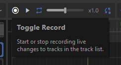

# Recording

Capture gameplay or hand-puppet properties to quickly animate parts of your scene, then tweak the recordings to polish everything up.

# Recording in Play Mode

This lets you act out the roles of characters by controlling them directly in-game, be a camera operator for a scene you've already animated, or capture gameplay for a trailer.

First create tracks for any properties you want to record. Common tracks will be added for you when dragging certain objects into the track list, like Player Controllers.

After that, enter play mode and press the Toggle Record button. Any changes to properties bound to tracks will get recorded directly to your movie. When you're done, hit the Toggle Record button again.

Your recording will still be in your movie when you exit play mode, letting you edit it further and save it.

# Recording in Editor

You can record even when the game isn't in play mode, letting you puppet properties as a starting point for polishing later. As before, make sure you've created tracks for any properties you want to record, then use the Toggle Record button to start and stop recording.

# Editing

After making your recording, you can then polish it up in the [Motion Editor](/animation/movie-maker/motion-editing.md) or [Keyframe Editor](/animation/movie-maker/keyframe-editing.md). Here's some extra recording specific tips:

## Cutting

Your best bet here is to save your recording to a separate .movie, then reference it as a [sequence block](/animation/movie-maker/sequences.md) in your main project. This lets you take clips from the recording, tweaking the start and end times as needed.

## Smoothing

Recordings can be shaky, especially when hand puppeting or manually operating a camera. Use the Smoothen option in the Motion Editor context menu to round out any rough edges in a selected time range. You can control how big the smoothing window is, with larger values leading to smoother tracks.

