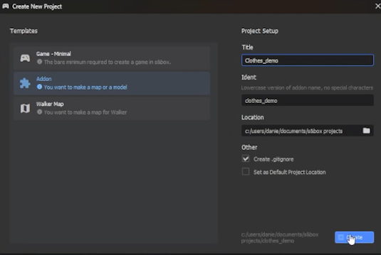
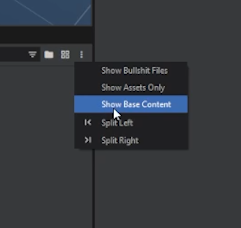
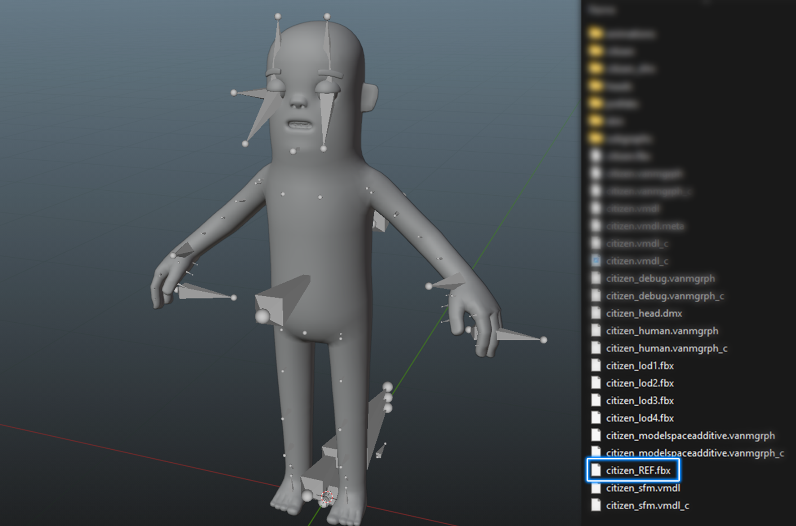
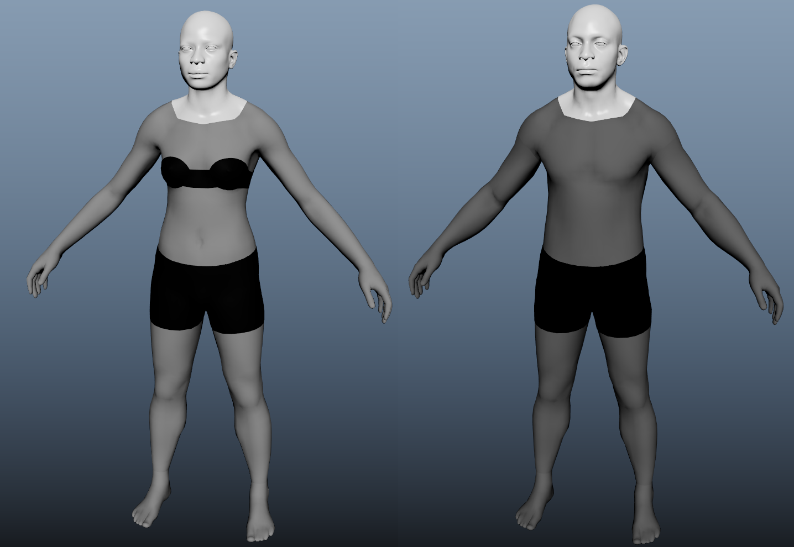

# First Time Setup

## First time Opening S&box 📦

[ 1280x720](./images/e64ec000-0b7a-4e14-b1f6-9c6893aacdd6.png)

 

Open S&box and make a new project. You can select 'Addon' as your template since we're only going to publish a model.

 

Make sure to turn on *'Show Base Content'*. This will allow you to see important 'core' folders and files in the asset browser, which you will be using during the clothing creation process.

:::warning
You will **never** need to add or adjust files within the core folders (e.g. the citizen addon folder). Only within your local project folder.

:::

---

## Grabbing Citizen Files 🤏

[setup2.mp4 1280x720](./images/ac3fd166-4c4b-48a3-aafc-c2e87c89b2d6.png)

Find useful files in `Steam\steamapps\common\sbox\addons\citizen\Assets\models\citizen`

In that folder can use `citizen_REF.fbx`, which supplies you with the citizen mesh and simple rig. 

 

:::info
Moving forward, we will use `citizen_REF.fbx` to build our clothing around it.

:::

:::tip
By the end of this set up, you should have the citizen in your 3D software of choice and you'll be ready to make some clothing.

:::

---

## Grabbing Human Files 🧍

We also have the `citizen_human_male_REF` and `citizen_human_female_REF`  which both have the same use-case, but for the human versions of your clothing. 

These can be found in `sbox\game\addons\citizen\Assets\models\citizen_human`. 

 

---
