# Layering Clothing

## **Layering of Shirts, Jackets, Trousers, Shoes and Gloves**

In S&box, we want a library of clothing that all fit together, resulting in hundreds, thousands of outfit combinations.

[ 1280x720](./images/c7890c21-10a8-4d67-b981-84573967d5a4.png)

If you're making a clothing piece, you'll need to consider what fits under or over it.  

---

## Simple Breakdown

 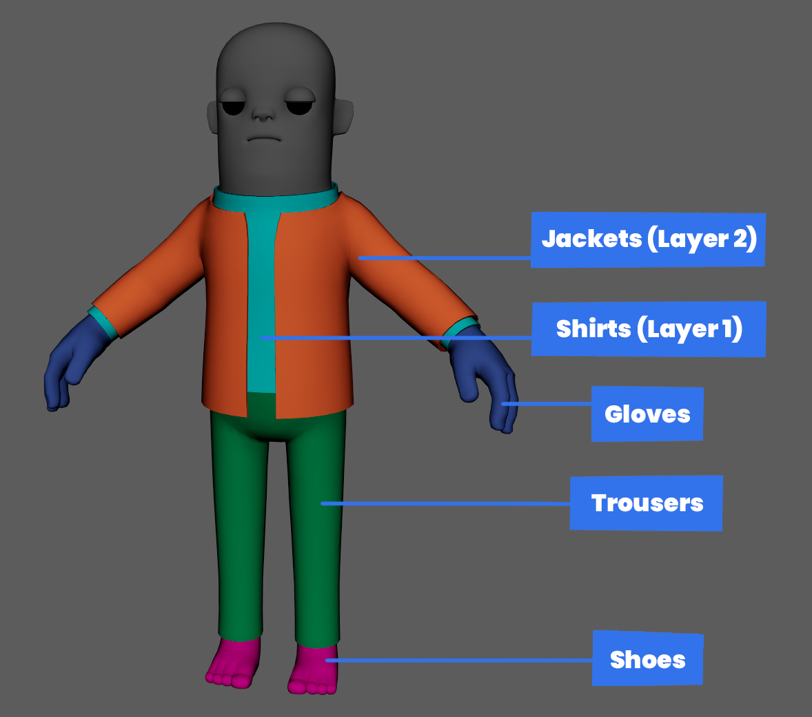

* A 2 layer system for the torso, shirts **(layer 1)** and jackets / vests / etc **(layer 2)**. 

  \
* Trousers are always tucked underneath the shirts.

  \
* Shoes are always tucked underneath trousers.

  \
* Gloves can be above or under shirts **(layer 1)** but never over / clipping into jackets **(layer 2)**.

  \
* If you're making an asset like a jumpsuit, that fills both the torso **(layer 1)** and the trousers area, this is fine. Though you will still need to make sure it fits underneath jackets **(layer 2)**.

* Full outfits are an exception to the rule, since they won't be fitting under or over any other clothing.

* If you are making a coat / vest / armour asset that doesn't show any of layer 1, for example a zipless Hoodie, you won't need to worry about it following the layering rule.

---

## Checking your Asset

A great way of making sure your clothing is fitting with the existing clothing, In your S&box project, place your clothing in a scene and add other existing clothing to check for clipping issues.

Right click in your '**Hierarchy**', add an empty asset. Clicking on this new asset, we can 'Add Component' in the Inspector. Type and click in Model Renderer. 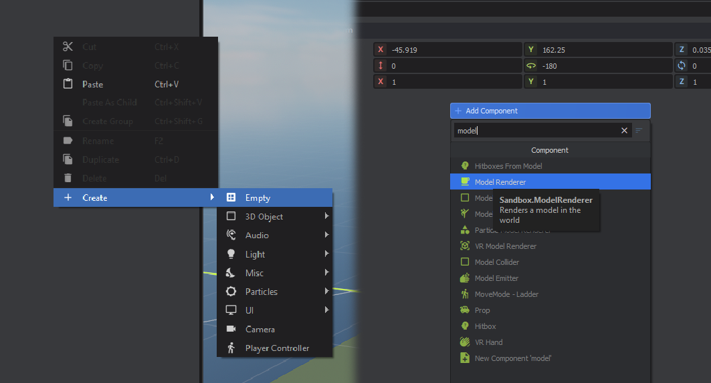

Click on the 'Model' input, opening a new window. Click onto the Citizen folder, which you can find at the bottom.

 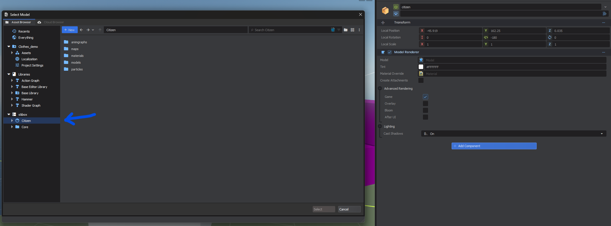

Head to `citizen\assets\models\citizen` and click on Citizen.vmdl. Now we have the citizen in our scene to start dressing and testing our clothing.

 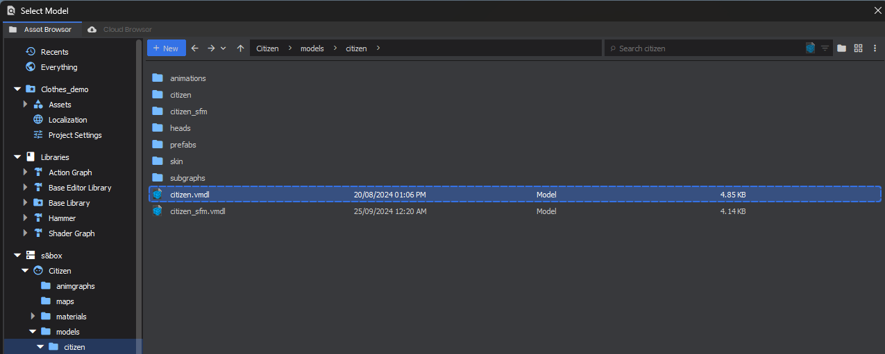

 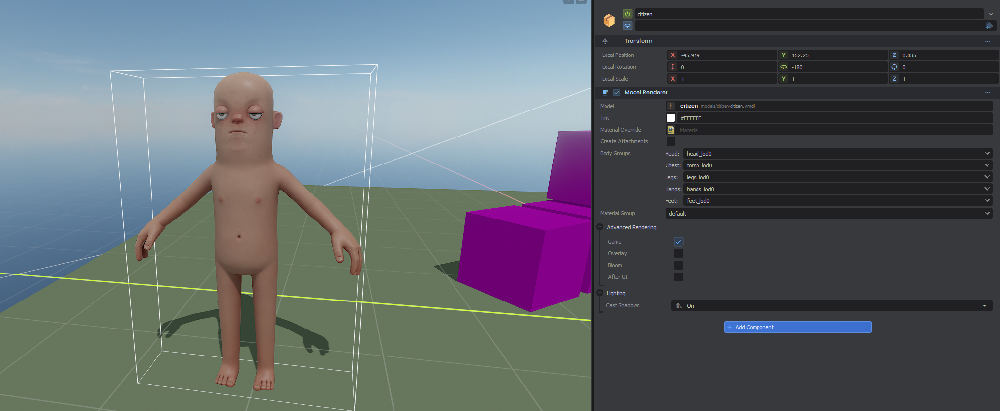

Now we can start adding clothing to test. Head over to `citizen\assets\models\citizen_clothes`, and we can start adding in clothing. 

 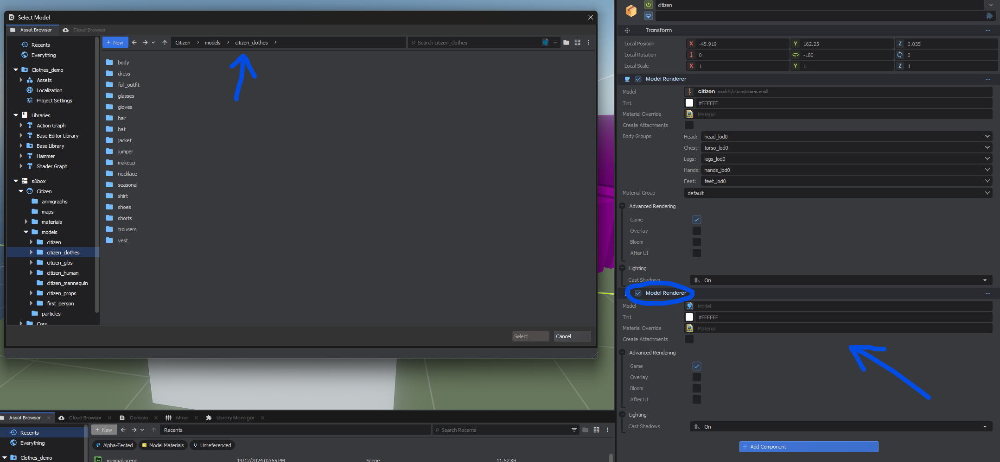 

In this example I will be testing the Polo Shirt, for any clipping issues. Which should sit under all jackets / vests / armour, etc.

 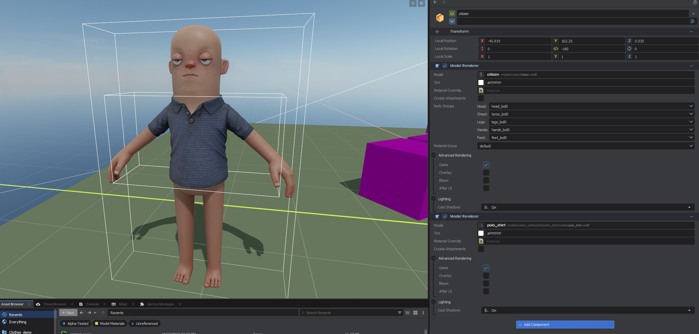

Add another component and add a layer 2 clothing asset. In this example I'm adding the Bomber jacket.

 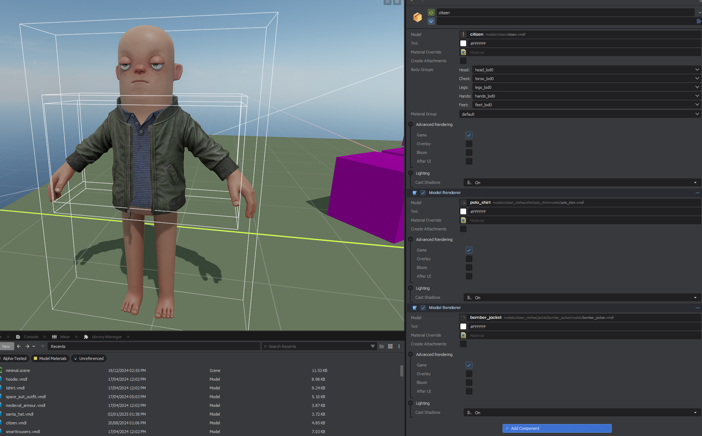

I can switch out the model input from the Bomber Jacket and try on other jackets.

 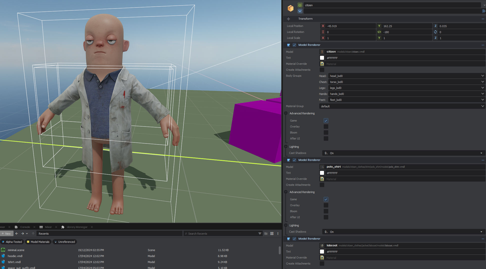

:::info
Try out a few jackets till you find any clipping with your shirt, or until you feel confident there is no obvious clipping.

:::

---

## Cutting the Citizen 👕🔪

 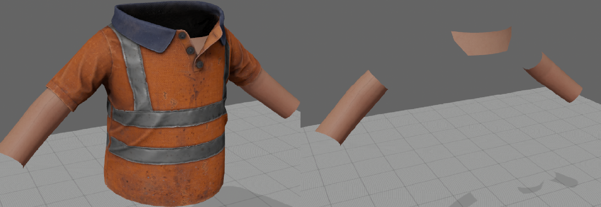

Complimenting this Layering System, Layer 1 Clothing, modeldocs for assets like the `binman_shirt`, we can use cut parts of the citizen torso which can be extracted from the `citizen_REF.fbx` and adjusted in the 3d modeling software of your choice. Extracting only the visible parts of the torso geometry.

 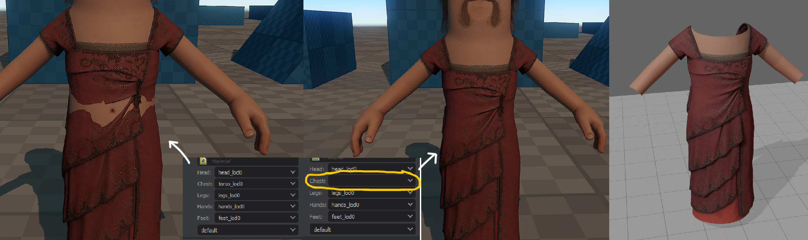

This becomes very handy for assets that change the silhouette of the citizen. Removing the torso/chest bodygroup. While replacing the skin with a cut-out version of the torso model.

---

## Gloves Layering 🥊

 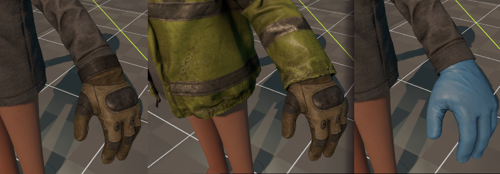

Gloves should sit **over** or **under** the Layer 1 clothing. They should never be any larger or clip with the Layer 2 Jackets, for the sake of preventing clipping. 

---

## Shoes Layering 👟

 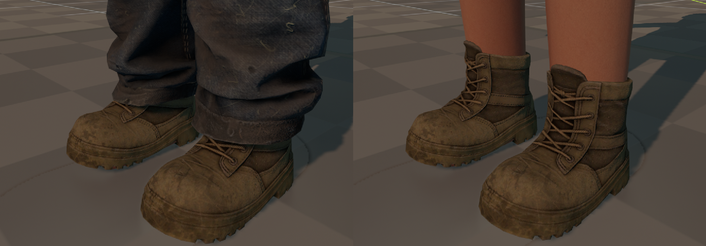

By default, most shoes should fit under all trousers. Which in most cases should be fine, keeping in mind to keep the trousers relatively wide, leaving for enough space for the shoes. 

 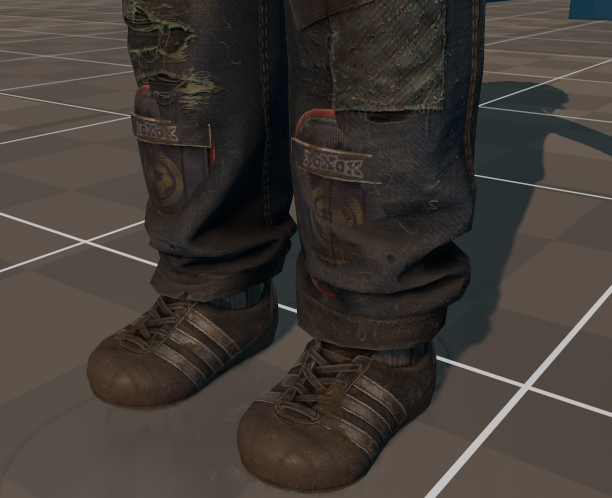

Though in some cases such as the `football_shoes` which have shinpads, reaching further up the leg, clipping is inevitable.

Considering the use-cases of each clothing item, users will more likely use the `football_shorts` which fit.

:::info
Clipping is inevitable, just keep a close eye on your silhouette of your assets and clipping shouldn't be too egregious. 

:::

---

## Full-Body Outfits

 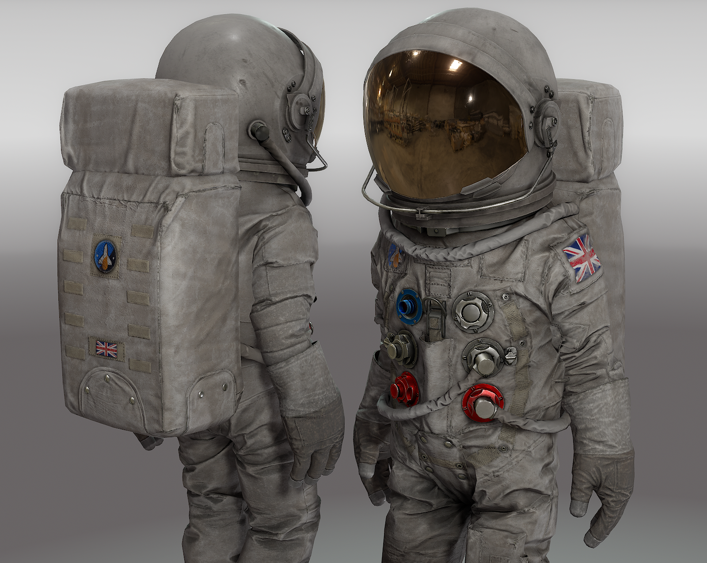

:::info
Outfits like the Skeleton, Mascot, Sci-fi Armour, Pirate Outfit, we are able to completely remove the citizen bodygroups. While still treating the assets as .clothing items and using the same logic as the clothing, we can completely replace the citizen.

:::

Full-Body Outfits are unique compared to the standard clothing and their layering system; they are bespoke and cover a majority or all of the body and would not fit with most clothing. 

**Context is Key**

For outfits like the `Pirate_Outfit`, it is a unique asset with a defined use-case, we treat it as it's own full outfit piece rather than breaking it up into modular layered pieces. 

Another example is the Sci-fi Armour, it covers the whole whole body and has a specific use-case, so would not need to mix or mash with other clothing assets, plus there's no good use-case for a sci-fi armoured character to wear a raincoat. 

For Full-Body Outfits that completely fill the character, the clothing takes up both Layer 1 and Layer 2, since it filling both spaces.

:::info
You definitely want to distinguish: is your clothing a modular / layer friendly asset, or if it's a unique full body outfit that isn't going to fitting under or over other clothing pieces.

:::
