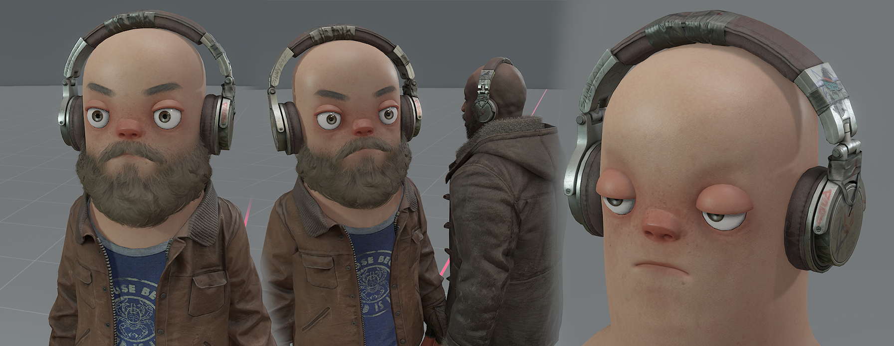
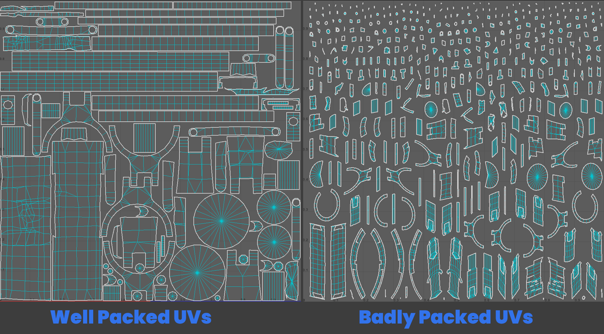
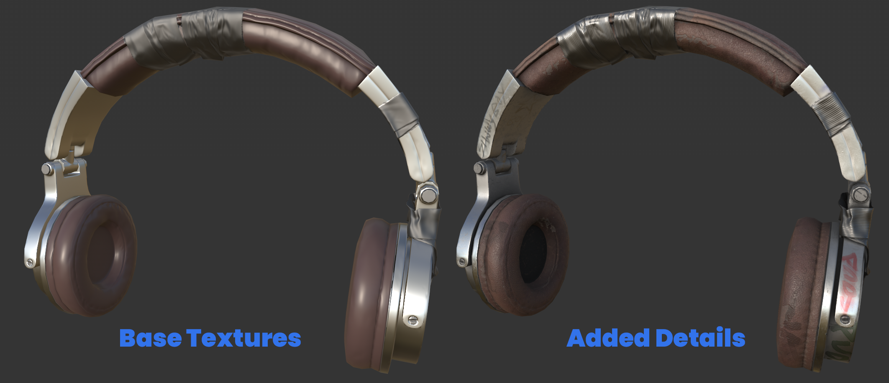

# Making a Hat

## **Making Hats / Headwear**

*A somewhat simple set-up compared to other clothing pieces, with less concern of layering with other clothing. This is a simple asset to rig and is easy to make a human version.* 

---

:::info
In this example, we are showing our process of creating and setting up Headphones.

:::
n 

---

## Highpoly 

:::info
These aren't guidelines or a tutorial to creating a highpoly, I'm expecting you to know how to make your own. We're hoping to demystify the creation of our assets, as well as showing it being made in accessible software.

:::

[
 1280x720](./images/509281ef-0ae4-415c-821d-efaa270079e1.png)

Generally, we expect you to make a highpoly to bake down onto your lowpoly. Whatever your approach, we expect an **ambient occlusion map**, **normal map** and **bent normal map**.

---

## Lowpoly, UV's & Baking

[
 1280x720](./images/0561139d-86cf-4c12-83df-21eb179c9852.png)

I aimed for anything under **4k tris** for my lowpoly**,** considering it's size and complexity. Anything a bit higher would be fine, but always worth considering your tricount. If you're finding it hard to work out how high or low your tricount should be, read our [Guidelines & Quality Bar](https://sbox.game/dev/doc/clothing/guidelines-quality-bar/) page segment on Tricounts.

### UVs

:::info
We expect you to have knowledge on creating UVs. We are just showing examples of UV's that allow for better baking and texturing, compared to poorly unwrapped and packed UVs. Especially when creating an asset like a Hat that only needs 1k textures, we want to make sure we're utilising our UVs effectively to fit in as much **texel density.**

:::

 

---

## Texturing 

[
 1280x720](./images/6cad5f4c-a301-4743-b155-c3468b307b31.png)

We'd recommend adding details that make the clothing look **used** rather than **factory new**. This lines up well with the current clothing we have created and the overall **worn and torn** aesthetic we lean towards.

:::info
We're not expecting you to dip your model in mud and stains, if you're making a space suit, it's not going to have ketchup stains.

:::

 

We'd steer away from completely flat and undetailed textures, there'd be rare exceptions to this rule, all depending on the context / art-style of your asset.

---

## LODs 

[
 1280x720](./images/da99acaf-c3c5-4199-be8d-da1990783d73.png)

You can follow our segment on LODs at our [Guidelines & Quality Bar](https://sbox.game/dev/doc/clothing/guidelines-quality-bar/) page. Which breaks down what tricounts you should aim for on each LOD.

The tricount for each LOD of the Headphones -

**LOD0** - `3640`

**LOD1** - `2432`

**LOD2** - `906`

**LOD3** - `171`

---

## Human Version

[
 1280x720](./images/e5898554-cdba-41d9-a749-1737c53b5be1.png)

Making a Human version of a hat is relatively easy, compared to other assets. Most hats you'll only need to **scale** and **move it's position** to fit onto the human head.

The Human version when exported, will need it's own .vmdl file, so in this example I **duplicated** my `headphones.vmdl` file, then **renamed** to `headphones_human.vmdl` - I kept the same set-up as the original vmdl file but changed the mesh files to our human version we just exported.

You can find more information about creating a human version of an asset on our [Morphing to Humans](https://sbox.game/dev/doc/clothing/morphing-to-humans/) page.
