# Publishing Clothing

## **Setting up your .Clothing File**

First, you'll need a fully set up .Clothing file. This is where we store our VMDLs and certain logic so your clothing works correctly. 

[ 1280x720](./images/7f29653f-8fa4-4e7d-aed2-041a4a1df1e5.png)

### Breakdown 

:::info
Before anything, we want to make sure we have our correct files. We want our vmdl for our clothing set up, as well as the human version vmdl. Plus of course the vmat file(s). Which should be applied in the vmdl files.

:::

 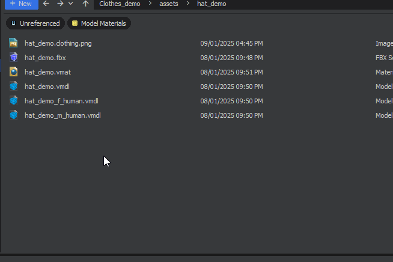

Right click in your folder - `New / Citizen / Clothing Definition` 

 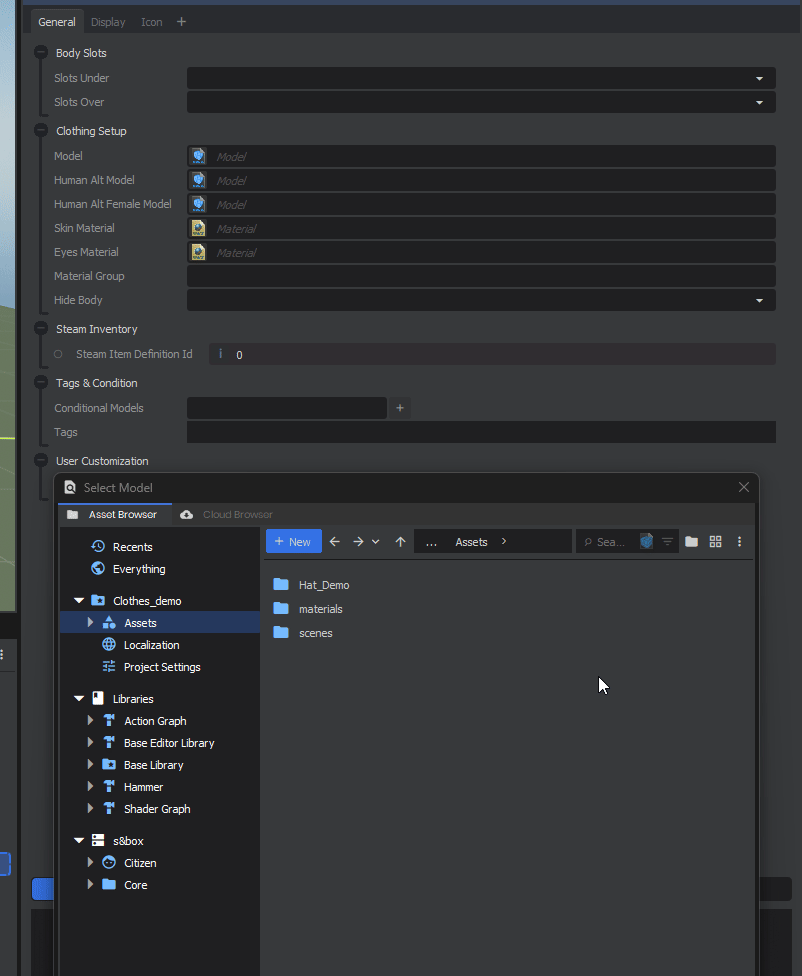

Add your Vmdls, original Citizen model goes in 'Model'. Standard male human version goes in `Human Alt Model` and your Female human variation goes in the `Human Alt Female Model`. 

### 

 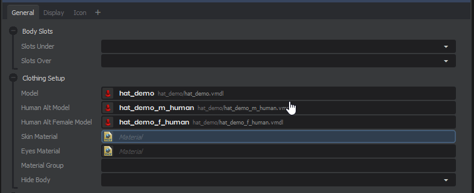

Give your Clothing a suitable name and description. In this example, we're making a Hat, so we set the category to `Hat` and we type *"**Hats"*** for the Sub Category. So it'll show up correctly in the character menu.

 

In Icon, we can generate a thumbnail for our .clothing file. Since we're making a hat, we want the Mode set to `Head`, which will orient the camera on the head. `Save Icon to Disk` to generate and save your clothing Icon.

 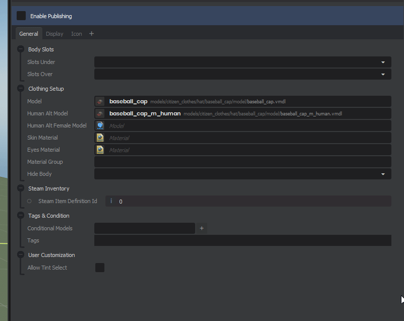

We also want to set our Body Slots, for a Hat like a baseball cap that only covers to the top of the Head, we'd want to set it to *Slots Under* - `HeadTop`.

## Quick Guide to Body Slots

Here's some examples of clothing and their body slots.

 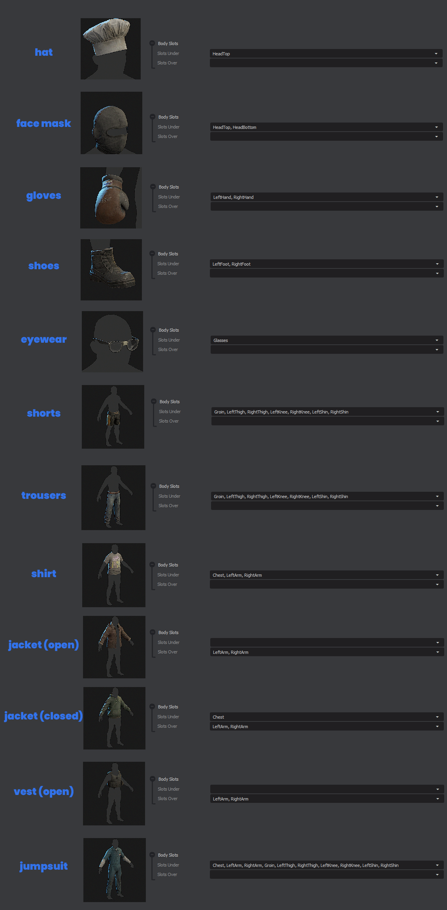

**Slots Under** is where shirts, trousers and shoes go, (Layer 1). Anything that fits over that would be **Slots Over**. This doesn't remove the Layer 1 clothing when selected, which would be for open jackets or vests; treat it as your Layer 2. 

 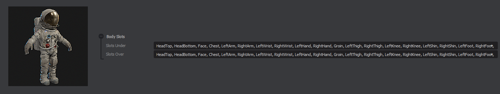

:::info
If you're making a clothing asset that completely covers the whole body. Select all the slots on both **Slots Under** and **Slots Over** to make sure nothing can be selected when it's worn.

:::

As an example, you can see that the **Shirt** has `Chest, LeftArm, RightArm` selected in **Slots Under.** 

To pair a jacket on top, the open Jacket (Open) has `LeftArm, RightArm` selected in **Slots Over.**

Though, if we have a jacket that sits on top of shirts, but completely covers the shirt as well as the whole torso bodygroup, we can use `LeftArm, RightArm` in **Slots Over** and `Chest` in **Slots Under**. Since Shirts have `Chest` selected in their **Slots Under**, this'll mean the shirt will be removed when selecting the **closed Jacket** since it's covering it completely.

Best bet is to follow the examples laid out above, if you're making a shirt, follow the Body Slots of the example.

:::info
**This seems like a lot to digest**, but the main thing to consider is -

What part of the body is being covered? If you're clothing is on Layer 1 (something that will have a jacket / vest / anything on top of it), then select your body slots in '**Slots Under'.  I**f you're clothing is on Layer 2 (open coat that's expected to sit on top of shirts), then select your body slots in **'Slots Over'.** 

Reminder to read over [Layering Clothing](/assets/clothing/layering-clothing.md) page to make sure you know which Layer your clothing is on. 

:::

---

## Publishing to sbox.game

Now let's publish our .Clothing file to sbox.game, where our clothing can be seen online.

[ 1280x720](./images/a96c7f35-b00e-4d36-8dbd-a91f24bbc4da.png)

### Breakdown 

 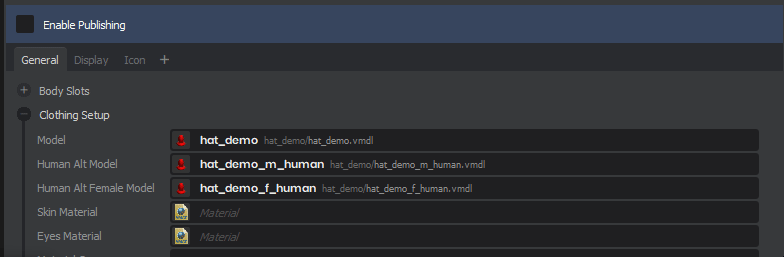

**Publish** your .Clothing file, and go to **Edit settings and Publish**

 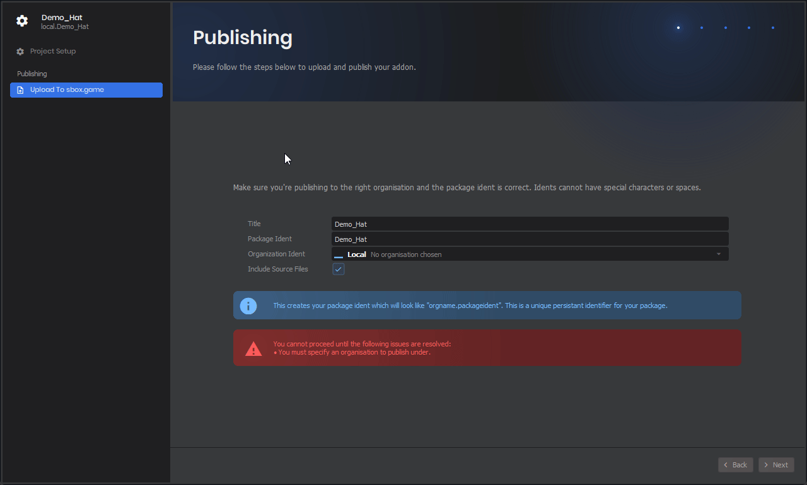

A new window will pop up, where you can set the title of your asset. Now we'll want to Create a **New Organisation**, or an existing one you may want to use. 

 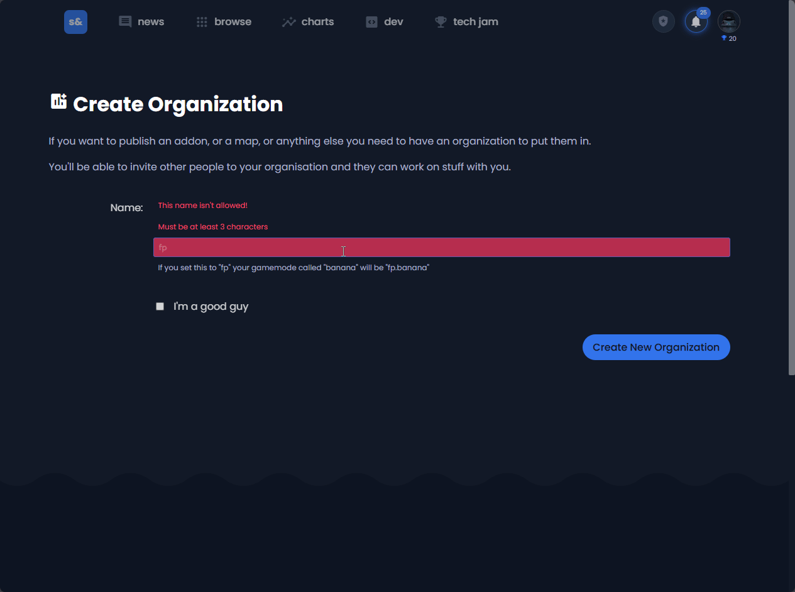

When clicking **New Organisation**, you will be taken to the **s&box.game** website. Here we can create a new organisation.

 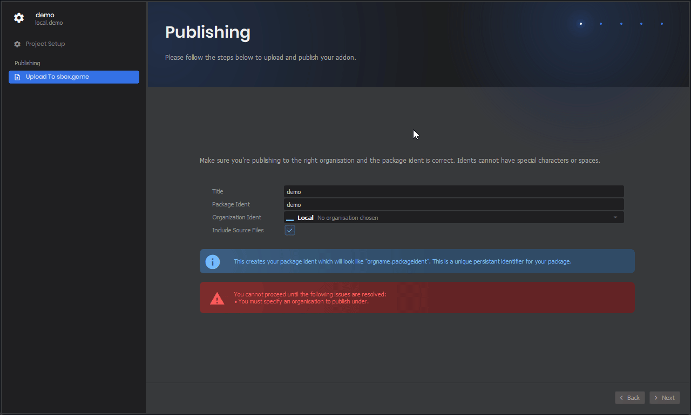

When creating a new organisation, you may have to restart s&box and open the publishing window again for it to appear in the Organisation Ident drop down.

Then you'll be able to add your organisation and press next to start **Uploading files and publish.** *Though the clothing won't be public just yet.*

 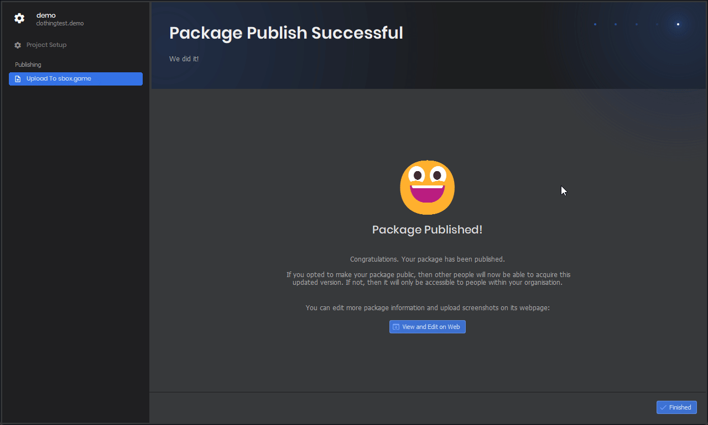

Here we can edit the asset on **s&box.game** website, for any final changes.

 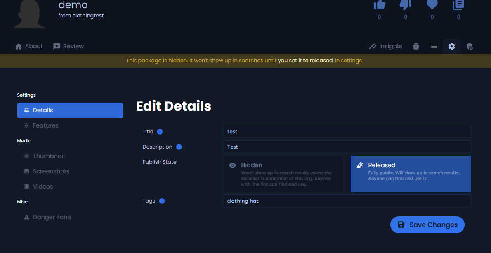

Here we add our appropriate title and description as well as relevant tags, you will want to add more that are specific to the theme of your clothing, `medieval` `metal` `armour`.

Now, we can set the **Publish State** to **Released** and **Save Changes.** The asset will now be visible online.

---
