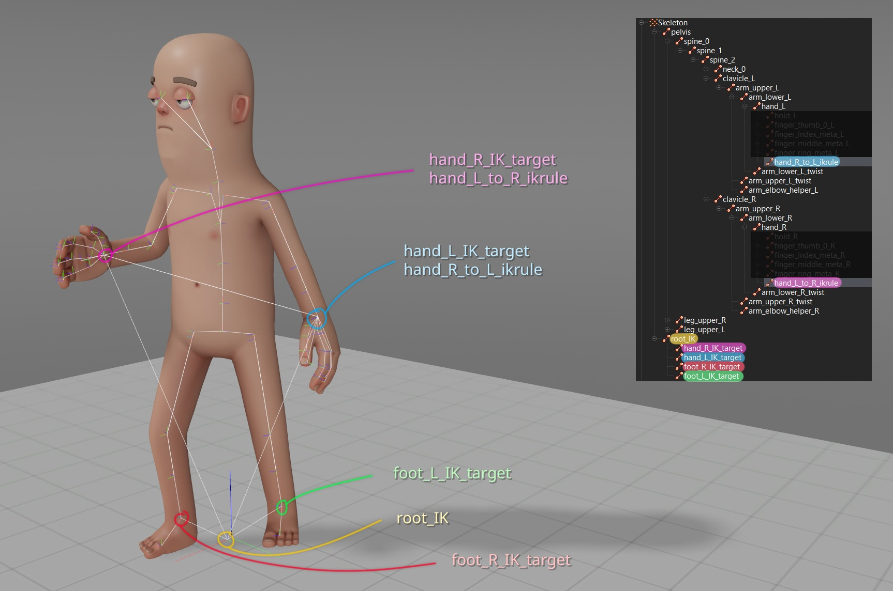

# Citizen Characters

The Citizen character is a default player model provided by Facepunch.

# How to use them?

:::info
This section needs to be rewritten with an explanation of all the code, libraries, etc.

:::

# Character source files

**All source files come with the game: VMDLs, FBXs, animgraphs, etc.**

You can find them right in the game folder, under `addons/citizen/models/citizen`. These files are synced straight from our source folders; when new source files are added on our end, they'll show up in that folder for you too!

:::info
If you would like to make animations for the Citizen, here is a community-made control rig to get you started: <https://github.com/Ali3nSystems/Ecodelia-Tools-for-Facepunch-Assets>

:::

## Procedural helper bones & constraints

These helper bones are set up to be procedural helpers driven entirely by constraints configured in ModelDoc. Open up `citizen.vmdl` and look at the *AnimConstraintList* prefab to see what makes them tick!

* `arm_upper_[R/L]_twist[0/1]` (from shoulder to biceps)
* `arm_elbow_helper_[R/L]` (better deformation for extreme bend angles on the elbow)
* `arm_lower_[R/L]_twist[0/1]` (from forearm to wrist)
* `leg_upper_[R/L]_twist[0/1]` (from pelvis to thigh)
* `leg_knee_helper_[R/L]` (better deformation for extreme bend angles on the kneecap)
* `leg_lower_[R/L]_twist[0/1]` (from calf to foot)
* `neck_clothing` (reduces the twist of the neck by two-thirds; some clothing items use it)

Because they're procedural, animation data doesn't need to be exported from your 3D program for these; in fact, it's set up to be ignored. Our own animation FBX files usually don't have them exported, which has the added benefit of slightly saving on file size. 

If you're making a model (e.g. clothing) to be bonemerged on top of the citizen, you don't actually *need* to skin your mesh to these bones... but it's better if you do!

:::warning
The limb bone is a sort of "container" for its `*_twist{0/1}` bones. **The limb bones aren't skinning anything and should never skin anything**; the twist bones are. Think of them as the "upper part" and the "lower part" of each limb respectively. This is how the height scaling feature works.

:::

# Adding new animations

If you only need to add a few animations to the VMDL, you can try using the "Base Model" feature. This is similar to the Source 1 "$includemodel" feature. **You can only add animations to an existing model using this feature; you can't add anything else.** You only need to reference the official `citizen.vmdl` file in the "Base Model" field, above the "Add" button in ModelDoc.

:::warning
Name your new animations something unique (maybe by giving them all a prefix); bad things could happen if animation names collide.

:::

You could also simply make your own "fork" of citizen.vmdl while keeping the references to prefabs intact, but you might have to sync some changes manually.

## IK bones

These bones are used to drive IK constraints in-engine. **They need animation data, and the default graph assumes it is present.** This data is baked by the 3D animation program during the exporting process.

 

`root_IK` is the parent to all `*_IK_target` bones. These are effectively "model-space" IK targets.

### **Why are we doing it this way?**

Because the position of IK targets need to be kept in a different space that won't be affected by any layers, weightlists, etc. that animation compositing is touching, otherwise we can't restore the positions through IK afterwards! Think of them as a way to keep the pos/rot data of hands and feet intact, separately.

`root_IK` is, in the control rig, constrained to follow X & Y of the pelvis, but with Z (height) forced to 0. It also needs to always point forwards (zero rotation), otherwise funky things can happen. Similarly, the hand/feet target bones are pos/rot constrained to their respective hand/feet bones in the control rig.

Additionally, there are two special IK bones, which are used to reproduce the `ikrule touch` feature from Source 1.

* `hand_L_to_R_ikrule` (child of right hand, constrained to the left hand)
* `hand_R_to_L_ikrule` (child of left hand, constrained to the right hand)

These are used as a way to keep the position and orientation of hands the same *relative to each other* (in their local space), even after applying layers, weightlists etc. and they are pos/rot constrained in the control rig.

In the animgraph, this is most often how the left hand is made to stick to a two-handed weapon that's driven by the right hand! It's not sticking to the gun itself, it's made to stick back to its original position relative to the right hand, even after all the aim matrices, breathing additive motion, etc. has been applied.

There may be different IK solutions implemented in the future.

## LOD reference & guidelines

To give you an idea of how we use LODs on the Citizen... here are the figures for the base meshes.

* **LOD0:** 6.6k tris (+ 7.2k head).
* **LOD1:** 4.2k tris (+ 7.2k head) @ distance of 5, so it happens fairly close and very fast. **This level is used to trim the low-hanging fruit that has an almost-zero impact to visuals, as soon as possible.** Here, we only use LOD1 to trim the poly density of the feet and fingers. The body and leg meshes remain the exact same; this means far fewer headaches with not needing to sync with underlying topology there. The head remains the same as LOD0(\*).
* **LOD2:** 1.7k tris (+ 1.0k head) @ distance of 20. We are at a medium distance, slightly on the side of long. Helper bones are culled.
* **LOD3:** 1.0k tris (+ 0.4k head) @ distance of 40. Long distance. Even more bones are culled.
* **LOD3:** 1.0k tris (+ 0.2k head) @ distance of 70. Longest distance. This only reduces the head further, cutting down a bit more of its geometry, but most importantly removes its eyes, which cuts down the material count (and therefore draw calls) by one.

*(\*) For now. Whenever our tech & tools allow us to start maintaining a lower-density head with no headaches with regards to transferring morphs etc., we'll probably try to target a 4-5k tris head for LOD1.*

Some clothing items might shift LOD1 back to a distance of 10 instead of 5, but this is only applicable when they are displayed on their own, away from the player; s&box implements a sort of "LOD sync", which makes bonemerged models follow the LOD level of their parent.

:::tip
Here's a decent rule of thumb for telling at which distances your model needs to switch down a LOD level. Zoom out slowly, and look at when the wireframe starts looking like "solid green". Of course, it doesn't tell the whole story, but it's a good place to start from.

:::

If you are using more than one material, and can cull the number of total materials back to one in your LOD meshes, you should do so!

## Stretching limbs

The Citizen has "support" for stretching and squashing the lengths of arms and legs while still looking reasonably good, thanks to the elbow & kneecap helpers. This is NOT actual "per-bone" scaling; the animations don't store scaling values. However, animations are, in a sense, fundamentally just a collection of lists of position & orientation coordinates for X bones at Y times. For example, the lower arm, being a child of the upper arm, sits in its parent space at a position of X = 10. There's nothing that prevents an animation from saying "in my animation, that X position offset is actually 12", meaning a 20% stretch.

Likewise, there's nothing that prevents any bone from changing its position in their parent's local space. Human anatomy doesn't work that way, of course, but the Citizen is not a photorealistic character, and pushing bones around in various ways allows to get more interesting poses! Almost all of the "long idle" standing poses do this to various extents.

## About source file scaling

All source files are in centimeters. But because just about everything else is using inches, the model is scaled down using the **ScaleAndMirror** modifier in ModelDoc. (We're NOT doing it at the import level on each mesh node.)

Therefore, if you want to create something for the character (clothing, etc.), you should also work in centimeters, with the provided sources, and in your VMDL, you'll apply the same ScaleAndMirror modifier with the same value of **0.3937**. (4 decimals only is an arbitrary choice on our part.)

### Why?

This way, no one has to do any scaling using 3D packages, which are notoriously unreliable and inconsistent in how they choose to perform the scaling, especially during export steps. Also, the ability to flawlessly and arbitrarily scale any 3D model, even animated ones, including all their data, is extremely valuable to have, and important enough to be dogfooding.
