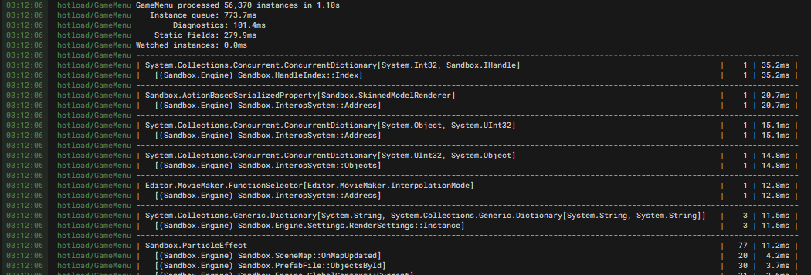

# Hotloading

Whenever you save a code file in your project (.cs or .razor files), we recompile and attempt to live-reload the changed assembly. This lets you quickly iterate and see your changes without needing to restart the editor. Ideally we want to support this for 99% of code changes without you needing to think about what happens under the hood, but this document will help you investigate cases where things go wrong.

# How it Works

If you change any type definitions, we need to explore the heap to find and upgrade any instances of those types. We do a full walk starting at static fields, recursing into instance fields that we think could contain stuff to upgrade.

### IL Hotload (Fast Hotload)

If you've only changed the bodies of methods, we can usually just patch in the new instructions without walking the heap. This is almost instant, and won't cause any of the pitfalls mentioned later on in this guide. It's enabled by default, but can be disabled in Editor Settings in the General tab.


:::tip
If disabling fast hotload fixes your issue, please let us know!

:::

# Optimization

Walking the heap can be very slow! Here's some tricks to help speed things up. These won't apply to IL hotloads.

### Diagnosis

Enter `hotload_log 2` in the console to get verbose timing information next time you hotload. This will generate a table describing how long it took to process instances of each type, and the total number of those instances. It's sorted by descending processing time, so the biggest culprit should be at the top.


 

If the number of instances increases drastically each hotload, you probably have a leak somewhere. For example, you might have a static list that you keep adding to and never clear. `hotload_log 2` lists the static fields through which instances were discovered, to help you find the source of leaks.

### Arrays

We have a fast path for arrays and lists containing value types, as long as they have no reference typed fields.

```csharp
public record struct UserStruct( Vector3 Foo, int Bar );

public int[] UserStructArray;        // Fast
public string[] StringArray;         // Slow
public object[] ObjectArray;         // Slow
public Vector3[] VectorArray;        // Fast
public UserStruct[] UserStructArray; // Fast
```

### Skipping


:::warning
**Internal**: this mostly only applies to engine development.

:::

We skip processing instances of a type if it can't possibly contain references to instances of user-defined types in its fields. Hotload can attempt to figure this out automatically, but you can force it to skip a field or entire type using the `[SkipHotload]` attribute.

You should be *very careful* with manual skipping. It can cause instances that should have been processed to leak into the post-hotload application state, causing lots of weird errors.


:::tip
Sealing classes will let hotload be certain that a user type can't inherit from it, so more types can be automatically skipped.

:::

# Pitfalls

Here's some cases that might have unexpected behaviour. Again, these don't apply to IL hotloads.

### Removing / Renaming Types

If you remove or rename a type, any references to instances of that type will be replaced with `null`. We try to account for this in the engine, for example removing components automatically if their types are removed, but you might have to handle this yourself too. You can always just restart the editor if you start getting lots of errors after removing a type.

We currently don't have a good way of detecting if a type is renamed, so at the moment this will behave like the old type was just removed completely.

### Changing Default Field Values

Since we copy the runtime value of fields into the newly loaded assembly (where possible), changing the default values of fields won't have an effect until you restart the editor. This doesn't apply to `const` fields or properties with get method bodies. You can also bypass this behaviour using the `[SkipHotload]` attribute.

```csharp
// Code before Hotload
public static Example1 = "Hello";
public static Example2 { get; } = "Hello";
public static Example3 => "Hello";
public const Example4 = "Hello";
[SkipHotload] public static Example5 = "Hello";

// Code after hotload                           // Actual runtime value
public static Example1 = "World";               // "Hello" ❌
public static Example2 { get; } = "World";      // "Hello" ❌
public static Example3 => "World";              // "World" ✔️
public const Example4 = "World";                // "World" ✔️
[SkipHotload] public static Example5 = "World"; // "World" ✔️
```

### Dictionary / HashSet

Extra care is needed for collections that call `Equals()` on your types. It's possible to make a code change that makes two previously non-equal instances start being equivalent, which can put dictionaries and sets into an invalid state.

We emit a warning if we detect that happening, and an editor restart might be required.

### Static Fields in Generic Types

We currently can't process static fields in any generic types during hotload. We emit a compile-time warning for any such fields to make sure you know that the values in those fields will be forgotten during hotloads. This warning can be suppressed using `[SkipHotload]`.

### Delegates / Lambda Methods

Hotload will do its best to let Delegate instances survive hotloads, but it might not always be possible for delegates implemented by lambda methods. This will usually happen if a method has multiple lambda methods inside it that get reordered, or if the definition changes drastically. If hotload isn't sure about how to process a delegate, it'll replace it with a delegate that logs a warning when invoked.


:::tip
If you get warnings about delegates that fail to process even when changing unrelated code, please let is know!

:::

### Reflection Caching

If you're caching the results of expensive reflection operations, be mindful that a hotload might mean cached values might become incorrect. You should always repopulate such caches after hotload, and mark the field containing the cache with `[SkipHotload]`.


:::warning
**Internal**: we have a `ReflectionCache<TKey, TValue>` helper dictionary type to do this for you.

:::


:::warning
**Internal**: we also need to consider reflection caches in third-party libraries, like System.Text.Json. These caches should also be cleared during hotloads if there's any possibility that they can contain user-defined types.

:::

### Concurrency

During hotload, we need to suspend all other managed threads that could possibly touch anything it processes. Hotload will politely wait for any active worker thread tasks (`GameTask.RunInThreadAsync` etc) to yield before it starts, so ideally you should write such tasks in an async way that yields often.


:::warning
**Internal**: we need to be careful about threads in engine code, they can't run during hotload unless they never touch anything hotloadable.

:::
