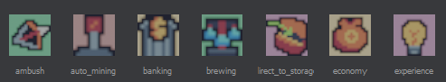
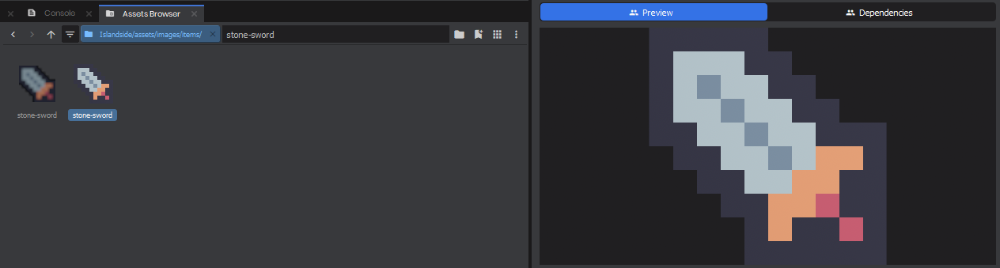

# Asset Previews

If you want a specific file/asset type to have a custom Thumbnail/Inspector Preview, you can simply create an AssetPreview. An AssetPreview initializes a SceneWorld and SceneCamera, rendering the Camera to the Preview output, so all you need to do is populate it and/or position the Camera to your liking.


 

## Model Example

```csharp
[AssetPreview( "mymdl" )]
public class PreviewMyModelResource : AssetPreview
{
	// The speed at which the model rotates. The length of a cycle in seconds is 1 / CycleSpeed
	public override float PreviewWidgetCycleSpeed => 0.2f;

	// This will evaluate a few frames and pick the one with the least alpha and most luminance for the thumbnail
	public override bool UsePixelEvaluatorForThumbs => true;

	public PreviewMyModelResource( Asset asset ) : base( asset )
	{
	}

	public override Task InitializeAsset()
	{
		// Get the resource from the asset
		var resource = Asset.LoadResource<MyModelResource>();

		// Get the Model from the resource
		var model = resource?.Model;
		if ( model is null )
		{
			return Task.CompletedTask;
		}

		// Make sure we are scoped to the preview scene
		using ( Scene.Push() )
		{
			// Create a new GameObject with a SkinnedModelRenderer component 
			PrimaryObject = new GameObject( true, "Model Preview" );
			PrimaryObject.WorldTransform = Transform.Zero;

			var modelRenderer = PrimaryObject.AddComponent<SkinnedModelRenderer>();
			modelRenderer.PlayAnimationsInEditorScene = true;
			modelRenderer.Model = model; // Set the model on the renderer

			// Center the scene around the model bounds, so the camera is positioned correctly
			SceneSize = model.Bounds.Size;
			SceneCenter = model.Bounds.Center;
		}

		return Task.CompletedTask;
	}
}
```


[How the Thumbnail and Preview appear
 1266x338](./images/bd940d31-8ca5-4b09-9c33-3b46d8f6cd73.png)

## Texture Example

```csharp
[AssetPreview( "mytex" )]
public class PreviewMyTextureResource : AssetPreview
{
	// Since we're only previewing a texture, we don't need to bother rendering a video
	public override bool IsAnimatedPreview => false;

	public PreviewMyTextureResource( Asset asset ) : base( asset )
	{
	}

	public override Task InitializeAsset()
	{
		// Get the resource from the asset
		var resource = Asset.LoadResource<MyTextureResource>();

		// Get the Texture from the resource
		var texture = resource?.Texture;
		if ( texture is null )
		{
			return Task.CompletedTask;
		}

		// Make sure we are scoped to the preview scene
		using ( Scene.Push() )
		{
			// Create a new GameObject with a SpriteRenderer component 
			PrimaryObject = new GameObject( true, "Texture Preview" );
			PrimaryObject.WorldTransform = Transform.Zero;

			var spriteRenderer = PrimaryObject.AddComponent<SpriteRenderer>();
			spriteRenderer.Texture = texture; // Set the texture on the renderer
			spriteRenderer.Size = 100;
		}

		return Task.CompletedTask;
	}

	public override void UpdateScene( float cycle, float timeStep )
	{
		base.UpdateScene( cycle, timeStep );

		// Override the Camera settings so the camera is fixed on the Texture
		Camera.Orthographic = true;
		Camera.OrthographicHeight = 100;
		Camera.WorldPosition = Vector3.Backward * 100;
		Camera.WorldRotation = Rotation.LookAt( Vector3.Forward );
	}
}

```

 
