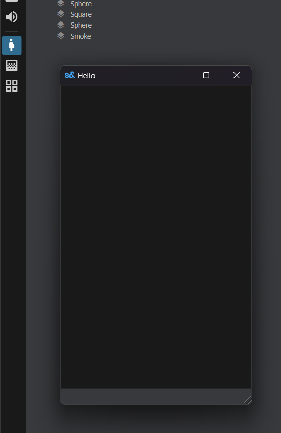

# Editor Apps

Editor Apps are apps that run in the editor. They generally have their own window. They're sometimes used to edit specific types of asset.

Examples of editor apps are the ShaderGraph, Material Editor, Model Editor.

# Creating


To create an Editor App, you just need to add an `[EditorApp]` attribute to its main window.

```csharp
[EditorApp( "Example App", "pregnant_woman", "Inspect Butts" )]
public class MyEditorApp : Window
{
	public MyEditorApp()
	{
		WindowTitle = "Hello";
		MinimumSize = new Vector2( 300, 500 );
	}
}
```


The app will be available on the App sidebar and the Apps menu.


 
