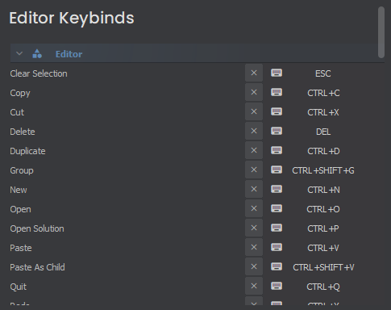

# Editor Shortcuts

When creating a Tool or Editor Project, it's common to want to be able to trigger certain actions with a key press or combined keystroke (Like `O` to enter Object Mode, or `SHIFT+B` to enter the Block Tool).

Editor Shortcuts do exactly that, while also giving the user the option to rebind each shortcut themselves.

 

# Creating a Static Shortcut

Shortcuts are created by adding the `[Shortcut]` attribute to a function, giving a name and default bind. The function can reside within any class (including static classes).

```csharp
[Shortcut("scene.toggle-gizmos", "SHIFT+G")]
static void ToggleGizmos()
{
    // Do stuff...
}
```

Now whenever you press SHIFT+G in the editor, this static function will be run if the primary Editor window is in focus.

# Creating a Widget Shortcut

Widget Shortcuts are created just the same, but there's some optional parameters to play with.

```csharp
[Shortcut("mesh.merge", "M", typeof(SceneViewportWidget), ShortcutType.Widget)]
private void Merge()
{
    // Do stuff...
}
```

The last 2 arguments are optional.

The first is which type of Widget you need to have in focus to do the shortcut (if none/null, assumes the class the function is defined in is the Widget type)

The second is the ShortcutType, which is either the `Widget` itself needs to be in focus, a `Window` containing it needs to be in focus, or the `Application` as a whole needs to be in focus.

So in this example, `Merge()` will only be called when pressing M while a SceneViewportWidget is in focus.
