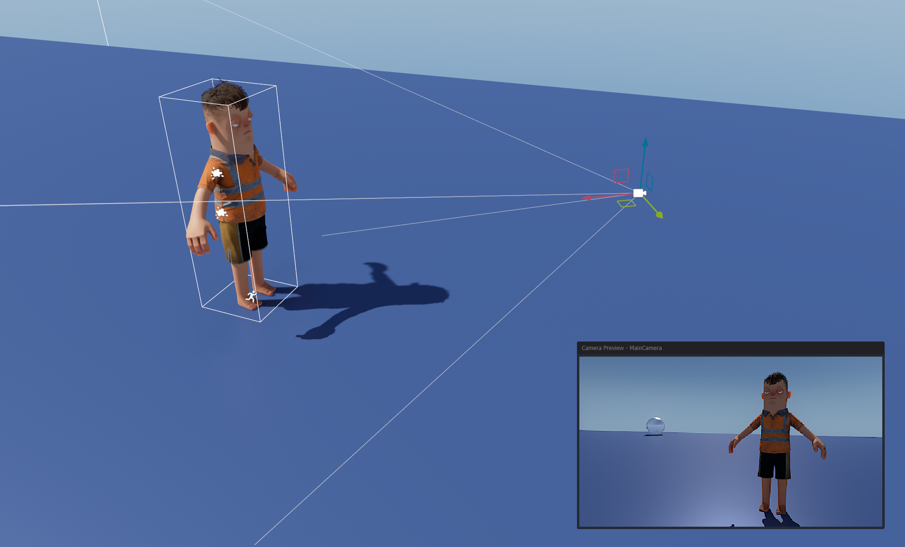

# Component Editor Tools

Component Editor Tools work a lot like regular Editor Tools, but they're always active when a specific [Component](/scene/components/index.md) is selected. These tools generally create UI in the scene view, but they can also override input too.

 

An example of a component tool is the camera preview - which is shown when a [GameObject](/scene/gameobject.md) with a CameraComponent is shown.

# Defining

To define an EditorTool for your Component, you create a class like this.

```csharp
public class MyEditorTool : EditorTool<MyComponent>
{

	public override void OnEnabled()
	{

	}

	public override void OnUpdate()
	{

	}

	public override void OnDisabled()
	{

	}

	public override void OnSelectionChanged()
	{
		var target = GetSelectedComponent<MyComponent>();
	}
}
```


The method `OnSelectionChanged` is called after the tool is created and registered. It can also be called later if the selection is changed to another component.

The tool is automatically deleted/destroyed when the selection no longer contains the specific component type.
