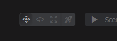
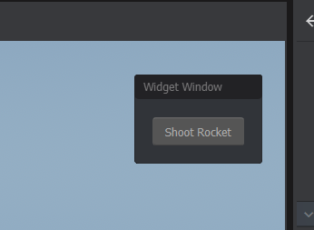

# Editor Tools

You can create your own editor tool to help you create your game. Your tool needs to be created in an [editor project](/editor/editor-project.md).


```csharp
[EditorTool] // this class is an editor tool
[Title( "Rocket" )] // title of your tool
[Icon( "rocket_launch" )] // icon name from https://fonts.google.com/icons?selected=Material+Icons
[Shortcut( "editortool.rocket", "u" )] // keyboard shortcut
public class MyRocketTool : EditorTool
{
	public override void OnEnabled()
	{

	}

	public override void OnDisabled()
	{

	}

	public override void OnUpdate()
	{
		
	}
}
```


This will create a tool that you can select here.


 

# The Scene

The EditorTool has a member called `Scene` to access the scene.

```csharp
public override void OnUpdate()
{
	var tr = Scene.Trace.Ray( Gizmo.CurrentRay, 5000 )
					.UseRenderMeshes( true )
					.UsePhysicsWorld( false )
					.WithoutTags( "sprinkled" )
					.Run();

	if ( tr.Hit )
	{
		using ( Gizmo.Scope( "cursor" ) )
		{
			Gizmo.Transform = new Transform( tr.HitPosition, Rotation.LookAt( tr.Normal ) );
			Gizmo.Draw.LineCircle( 0, 100 );
		}
	}
}
```


# Preventing Selection

Depending on how your tool operates, you might want to prevent the user's ability to click to select [GameObjects](/scene/gameobject.md) in the scene. To do this you can change `AllowGameObjectSelection` on your tool.

```csharp
public override void OnEnabled()
{
	AllowGameObjectSelection = false;
}
```


# Creating Overlay UI

You can create UI on the scene's overlay. This is useful for creating controls and other things.

```csharp
public override void OnEnabled()
{
    // create a widget window. This is a window that  
    // can be dragged around in the scene view
	var window = new WidgetWindow( SceneOverlay );
	window.Layout = Layout.Column();
	window.Layout.Margin = 16;
 
    // Create a button for us to press
	var button = new Button( "Shoot Rocket" );
	button.Pressed = () => Log.Info( "Rocket Has Been Shot!" );

    // Add the button to the window's layout
	window.Layout.Add( button );

    // Calling this function means that when your tool is deleted,
    // ui will get properly deleted too. If you don't call this and
    // you don't delete your UI in OnDisabled, it'll hang around forever.
	AddOverlay( window, TextFlag.RightTop, 10 );
}
```

The UI is created when the tool is activated, and destroyed when it's deactivated.

 
