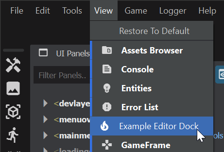
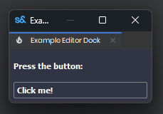

# Editor Widgets

Editor UI is built entirely out of Widgets. Widgets are different from [Panels](/systems/ui/index.md), which are used for in-game UI. Widgets can be various elements or components, such as labels, buttons, text boxes, trees, or images.

If a Widget does not have a parent, it is a Root Widget. This Widget will act as a window on the user's OS.

# Creating a Widget

Each Widget has a Layout, which can contain child Widgets or sub-Layouts. Widgets can also be styled with CSS similarly to Panels.

```csharp
public class ExampleWidget : Widget
{
	public ExampleWidget(Widget parent) : base(parent, false)
    {
        // Create a Column Layout
		Layout = Layout.Column();
        // Give it some Margins/Spacing
        Layout.Margin = 4;
        Layout.Spacing = 4;
        // Apply some CSS styling
        SetStyles( "background-color: #303445; color: white; font-weight: 600;" );
        
        // Add some child Widgets to the Layout
        Layout.Add(new Label("Press the button:", this));
        var btn = Layout.Add(new Button("Click me!", this));
        btn.Clicked += () =>
		{
			Log.Info("You did it!");
		};
	}
}
```

You can now create this Widget anywhere else in your Editor Project by doing the following:

```csharp
// Creates the Widget as a new Window since it has no parent
var windowExample = new ExampleWidget(null);
windowExample.Show()

// Creates the Widget as the child of another Widget, then adds it to that Widget's Layout
var childExample = new ExampleWidget(parentWidget);
parentWidget.Layout.Add(childExample);
```

# Creating a Dockable Widget

Creating a Widget with the \[Dock\] attribute will allow it to be docked within any DockWindow. It will also be added to the View menu so it can be toggled easily.

```csharp
[Dock("Editor", "Example Editor Dock", "local_fire_department")]
```

  


# Creating an Asset Editor

Including the \[EditorForAssetType\] attribute will open your widget upon double-clicking the specified asset. Doing this will invoke `AssetOpen()` on your Widget through IAssetEditor so you can get any Asset information.

```csharp
// Supply the file extension of the asset, cannot be more than 8 characters
[EditorForAssetType("item")]
public class ItemEditorExample: Window, IAssetEditor
{
    // Return false if you want the have a Widget created for each Asset opened,
    // Return true if you want only one Widget to be made, calling AssetOpen on the open Widget
	public bool CanOpenMultipleAssets => true;
 
    Asset MyAsset;
    ItemResource MyItem;
    Label MyLabel;

	public ItemEditorExample()
    {
        // Cannot modify the Layout of a Window, instead we have a Canvas Widget
        Canvas = new Widget( null );
        Canvas.Layout = Layout.Column();
        Canvas.Layout.Spacing = 8;
        Canvas.Layout.Margin = 8;
        MyLabel = Canvas.Layout.Add( new Label( "", this ) );
        var btn = Canvas.Layout.Add( new Button( "Reset Name", this ) );
        btn.Clicked += ResetName;
        Show();
    }

    // From IAssetEditor
	public void AssetOpen(Asset asset)
    {
        // Get the Resource from the Asset, from here you can get whatever info you want
        MyAsset = asset;
        MyItem = MyAsset.LoadResource<ItemResource>();
        MyLabel.Text = MyItem.Name;

		// If CanOpenMultipleAssets returns true, you should refocus this widget
		Focus();
	}
 
    // From IAssetEditor
    public void SelectMember(string memberName) { }
 
    void ResetName()
    {
        // If we modify the Resource at all, we can save those changes with SaveToDisk
        MyItem.Name = "N/A";
        MyLabel.Text = MyItem.Name;
        MyAsset.SaveToDisk(MyItem);
    }
}
```
