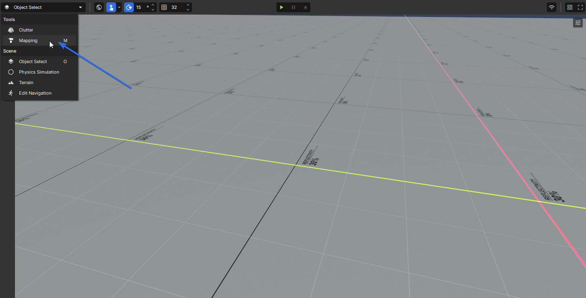
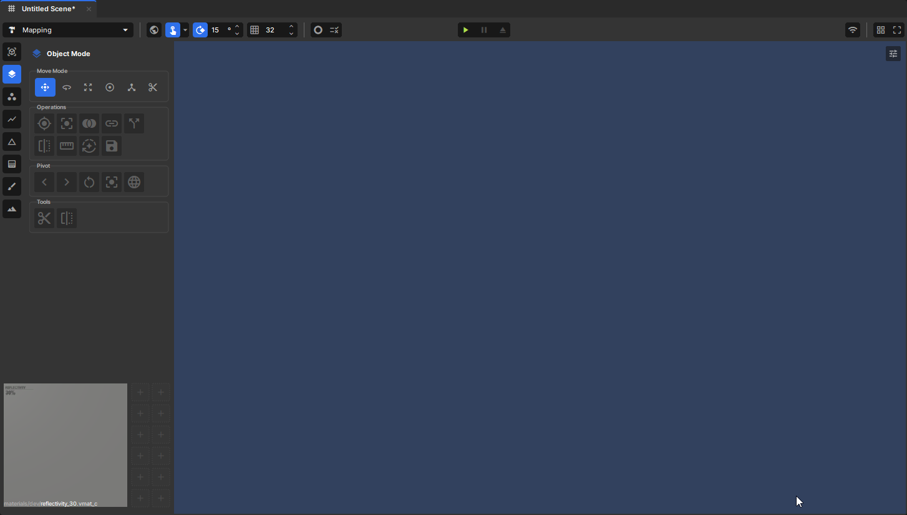

# Tools Overview

This page breaks down the mapping editor's UI and gives an overview of the tools available to you.

> Many shortcuts in the mapping editor intentionally match Hammer, so if you have a background in Source engine mapping you should feel right at home. See the [Shortcuts](./shortcuts.md) page for a full reference.

## Entering mapping mode

In the top-left of the scene view is a mode dropdown. Click it and select **Mapping**, or simply press **M**.

## Tools overview

The toolbar is the hub for all mapping functions. From here you can create meshes, edit their geometry, texture surfaces and paint vertex colours. Everything you need to go from a blank scene to a finished level is accessible directly from this toolbar.

### Tool modes

Each tool in the toolbar serves a specific purpose in the mapping workflow. The tools below are listed in the order they appear in the toolbar, top to bottom.

| Tool | Shortcut | Description |
|------|----------|-------------|
| Primitive Tool | Shift + B | Creates different types of primitives (box, sphere, cylinder, etc.) |
| Object Mode | 5 | Select and transform objects |
| Vertex Tool | 1 | Select and edit vertices |
| Edge Tool | 2 | Select and edit edges |
| Face Tool | 3 | Select and edit faces |
| Texture Tool | 4 | Apply materials to faces and adjust texture alignment, scale, and rotation |
| Vertex Paint | 6 | Paint colour or blends directly onto mesh vertices |
| Displacement | | Sculpt and displace vertices to create organic shapes |

### Move modes

Once you have a selection, move modes control how you transform it. They are available across all mesh editing tools and switch the active gizmo to the corresponding transform. The modes below are listed in the order they appear in the toolbar, left to right.

| Mode | Shortcut | Description |
|------|----------|-------------|
| Position | W | Move the selection along one or more axes |
| Rotate | E | Rotate the selection around a pivot point |
| Scale | R | Scale the selection uniformly or per-axis |
| Resize | Y | Resize the selection by pushing faces outward from a centre point |
| Pivot | T | Reposition the pivot point used by other move modes |
| Shear | | Shear the selection, skewing it along an axis |
