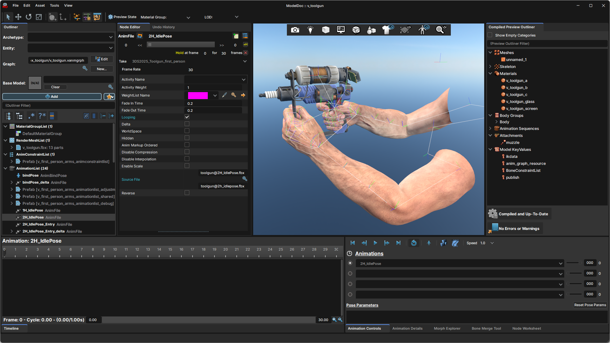
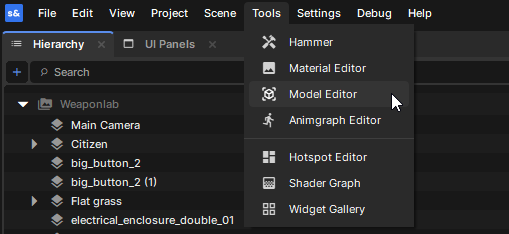
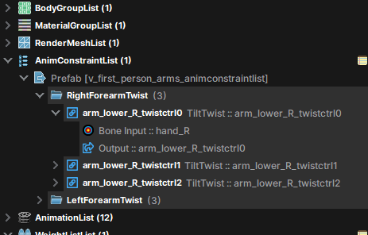
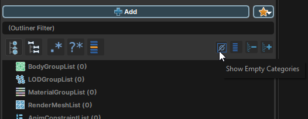
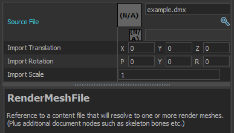

# Model Editor

The "Model Editor", also known as "ModelDoc", is where you can create and edit model (VMDL) files. This is the modern equivalent of Source 1's .QC files. You can find it under the "Tools" menu.

 

Instead of text commands, everything uses nodes. They can be nested.

 

We ship some of our own model sources so you can take a look at them, modify them, and see how everything works. For example, you can find citizen.vmdl at `sbox\addons\citizen\Assets\models\citizen\citizen.vmdl`.

When downloading cloud assets from the editor, some of their authors may have chosen to include their source files; this is the case for our first-person weapons.

# Nodes

 

All nodes are organized into categories. You can click *"show empty categories"* to display them all.

Nearly every node will automatically sort itself into a category, and won't work outside of them.

Right-clicking a category will show the nodes relevant to that category.

# Best practices

* **Unless your model is meant to be fully static, it should have at least one animation sequence.** Just a bindPose should be enough: a simple "AnimBindPose" node will be enough. Otherwise, for optimization purposes, some things may invisibly break (morph targets won't work, IK data will mysteriously go missing, etc.)
* **Do not create bones directly in ModelDoc unless you absolutely must** — this feature should be seen as a "last resort", when you absolutely can't go into 3D software to create the bone in the source file. You should only rely on that feature if you have a completely rigid prop (no articulations, no "jiggle bones", no cloth, etc.) and you need to define ONE attachment (or attachment bone) for it.
* **Your FBX files should ideally be binary, not ASCII.** This is because Blender users can only import binary FBX files. Keep this in mind if you're working with others, or when distributing your source files.
* **Keep the download size of your addon in mind.** Compress your files and textures up to the point that's needed.
* **If your model has multiple materials, name them accordingly.** If a material has a period in its name everything after it will get omitted, resulting in multiple materials of the same name, which gets collapsed into only one when imported *(example: Blender naming materials .001, .002, etc. when using the same names)*

# Frequently asked questions

## Can you import MDL/FBX/SMD...?

ModelDoc supports:

* Valve's own formats: DMX (should be version 22?), and SMD (technically deprecated, but usable)
* Typical 3D formats: FBX, OBJ, VOX
* Multiple animations per FBX file (also known as "takes" in the FBX format)

What's NOT supported:

* Source 1 and GoldSrc MDL (support was removed)
* Vertices with more than 4 weight influences. *Weights will automatically get culled and normalized, which is far from ideal; best to plan your skinning with this in mind from the start!*

### How do I import several animations at once?

Use the *"Add Simple Animations"* feature. You can access this by clicking on the little star icon next to "➕ Add" or by right-clicking *AnimationList*.

### How do I create a player model for s&box?

You need to create a character model, with its own animgraph that will respond properly to the inputs of the Animation Controller. This involves all steps of model creation, along with animating and creating the graph yourself.

If you can't or don't want to do all this for your new character, you can work "on top of" the Citizen, or extend it, using the "Base Model" feature, or by "forking" the VMDL by reusing part of it (through referencing its prefabs, for example)

### How do I decompile a compiled model (VMDL_C)?

Ideally, you shouldn't decompile a model. You're likely to get something that's not usable without some (if not lots of) work. If you want to modify something someone else made, you should ask them first!

The cleanest way to generate source files back out of an existing VMDL is to open it in ModelDoc, and use the *Export As...* function. It can export any meshes (including skinned ones) as FBX or OBJ. It will also attempt to export the maps used by the model's materials.

You may also try to use the [Valve Resource Format](https://github.com/SteamDatabase/ValveResourceFormat/releases) explorer to attempt to export individual animations, though they will need some clean-up.

### How do I move/scale a model in ModelDoc?

It is recommended you modify location and rotation manually in a separate modelling program. Alternatively, for scale you can use the **ScaleAndMirror** node for scaling your model. If your mesh is static (not skinned to any bones), you can change its position, orientation, and, scale in the same **RenderMeshFile** node you used to import the model:

 

:::warning
Because animation nodes don't have individual scaling settings, scaling a mesh without its animations would effectively break the animations. Therefore, for animated models, using the ScaleAndMirror global modifier node is preferred.

:::

### I have missing bones!

By default, bones that are not skinning anything will be transparently discarded. You can prevent this behaviour in two ways:

1. Create a BoneMarkup node for your bone, and tick "Do Not Discard"
2. Set "Bone Cull Type" to "Leaf Only" or "None" on the root "BoneMarkupList" container.

Keep in mind that fewer bones are best for performance.

You can check the compiled hierarchy in the "Compiled Preview Outliner", under "Skeleton"; this lets you know what may have been discarded, changed, or otherwise modified.

## My morph target (blend shape) isn't importing properly!

* Make sure the material used by your mesh has morph enabled in its material properties!
* There must not be any underscores in the names of your shapes. In the DMX specification, underscores are specifically for corrective shapes. See [this page](https://developer.valvesoftware.com/wiki/Flex_animation#Corrective_shapes) on the Valve Developer Community wiki for more information.

# What's "Base Model"?

Think of it as an equivalent of Source 1's [$includemodel]() which was used by your "main" model to reference animation-only models.

However, in s&box, it works the other way around! For example, if you want to extend the Citizen character with new animations, your new VMDL (e.g. "citizen_my_custom_version.vmdl") would be referencing "citizen.vmdl" as its "Base Model".

:::warning
**Your new VMDL should only hold new animations, and nothing else.**

:::
