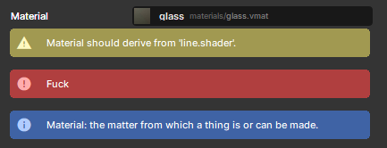

# Property Attributes

You can add attributes to your Component's properties in C# to change how they look in the editor/inspector.

## `[Hide]`

Hides the property from the editor. Will still be a property, and will still save and load - but won't be visible.

## `[RequireComponent]`

Added to a property containing a component. The component will be created if it doesn't exist.

## `[Group( "Helpers" )]`

Will create a group box and add this property to that group. Mark multiple properties to add them to the same group.

## `[ToggleGroup( "UseHelpers" )]`

A group that has a checkbox to turn it on and off. The name should match the name of a bool property to hold the state.

## `[Title( "My New Title" )]`

Change the title of the property in editor, instead of using the property name.

## `[Feature( "Helpers" )]`

Adds this property to a separate feature tab. All other properties will be in a tab called General.

## `[FeatureEnabled( "Helpers" )]`

Should be used on a bool property. This allows you to turn the feature on and off by removing or adding the tab.

## `[Order( 100 )]`

Change the order of this property in the editor. Their position in the source usually orders them.

## `[ShowIf( "PropertyName", 3 )]`

Only show this property if another property is equal to the value.

## `[HideIf( "PropertyName", 3 )]`

Hide this property if another property is equal to the value.

## `[Range( 0, 100 )]`

When used on a number property, the control widget will have a **min and max value** provided, with an **optional argument to clamp the value** (enabled by default, so the user cannot manually input a number outside of the range) **and another to show a slider** instead of a number field (enabled by default)

## `[Step( 10 )]`

When used on a number property, the control widget will only increment by the step amount provided when clicked and dragged.

## `[Space]`

Add a space above the property.

## `[Header( "My Header" )]`

Add a header above the property.

## `[ReadOnly]`

Don't allow changing this property.

## `[Flags]`

Indicates that an enum can be treated as a set of flags. Allows for selecting multiple flags at once from the dropdown instead of just selecting one.

## `[InlineEditor]`

Tell the editor to try to display inline editing for this property, rather than hiding it behind a popup.\n(useful for custom Classes/Structs)

## `[WideMode]`

Fill the width of the editor with the widget and put the label above instead of to the left of the ControlWidget. Can optionally hide/remove the label entirely.

## `[Validate( nameof( IsValid ), "Warning Message", LogLevel.Warn )]`
n 

Specifies a method in the same class to use for validation. The validation result will be shown in the inspector.

# String-Specific

## `[Placeholder( "Your mother's maiden name" )]`

When used on a string property, will show this text when it's empty.

## `[TextArea]`

When used on a string property, show a multiline text area instead of a single-line text edit.

## `[FilePath]`

When used on a string property, creates a File Picker allowing you to select any file, with an optional Extension you can use to specify certain file type(s).

## `[ImageAssetPath]`

When used on a string property, creates a ResourceControlWidget allowing you to select an image file, setting the string's value to the path of the image.

## `[MapAssetPath]`

When used on a string property, creates a ResourceControlWidget allowing you to select a vmap file, setting the string's value to the path of the map.

## `[FontName]`

When used on a string property, creates a Font dropdown allowing you to easily select a font by it's name.

## `[InputAction]`

When used on a string property, creates an Input dropdown comprised of all Inputs configured in your Project Settings, allowing you to easily select an Input by it's name.

# Curve-Specific

## `[TimeRange]`

Used to specify a default or clamped time/x-range on a curve

## `[ValueRange]`

Used to specify a default or clamped value/y-range on a curve

# ActionGraph-Specific

## `[SingleAction]`

When used on any ActionGraph-compatible property, it will only show a single action to edit instead of a list that allows you to create multiple
