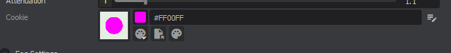
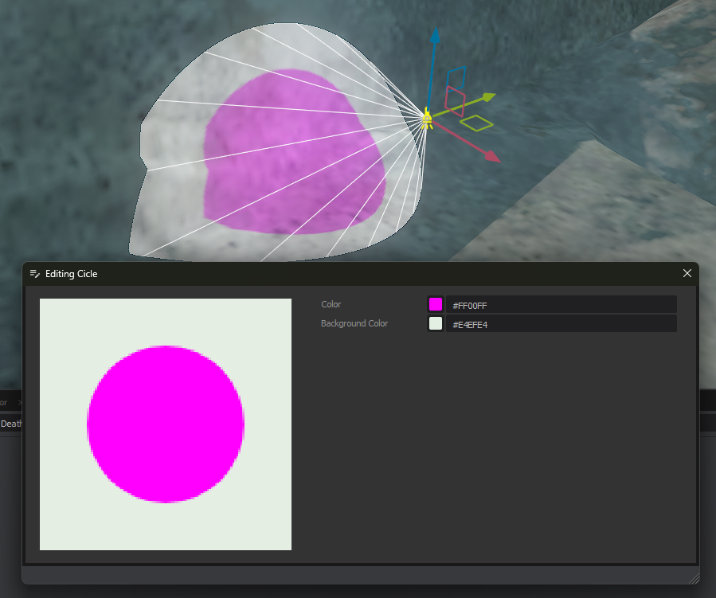

# Texture Generators

In the editor Textures can be generated in a number of ways. They can be created from an image (which is pretty normal), or a color, or a gradient, or text, or SVG source. These are called texture generators.


You can create your own texture generators in code, and they will then be selectable.

```csharp
[Title( "Cicle" )]
[Icon( "palette" )]
[ClassName( "circlegenerator" )]
public class CircleTextureGenerator : Sandbox.Resources.TextureGenerator
{
	[KeyProperty]
	public Color Color { get; set; } = Color.Magenta;

	public Color BackgroundColor { get; set; } = Color.White;

	[Hide, JsonIgnore]
	public override bool CacheToDisk => true;

	protected override ValueTask<Texture> CreateTexture( Options options, CancellationToken ct )
	{
		var bitmap = new Bitmap( 128, 128 );

		bitmap.SetFill( Color );

		bitmap.Clear( BackgroundColor );
		bitmap.DrawCircle( 64, 64, 40 );

		return ValueTask.FromResult( bitmap.ToTexture() );
	}
}

```


The code above creates a circle texture generator. It draws a circle in the middle of a 128x128 texture.

 

You can select the color of the circle and the background in the UI.

 

## Properties

Any properties on your generator are automatically saved and restored, and are editable in the UI. To hide a property and stop them serializing, use `[Hide, JsonIgnore]`.

The properties can use all the same attributes as Component properties, like `[Range]` an `[Header]` etc.

## Cache To Disk

By default Texture Generators are runtime. They generate the texture on load. That isn't always ideal, because the generation might take longer than it would take to read the texture from disk.

If you override `CacheToDisk` and set it to true, on compile the texture will be generated and saved to disk, and will be loaded from that file instead of generated at runtime.

This is also useful if you're not going to ship the texture generator with your game (or whatever is going to use the texture).

# Code Location

If you need your texture generator to run at runtime, because you're not caching to disk, then you should put it in your game code.

If you only need it to run in the editor - then you can put it in your editor project (or library).
