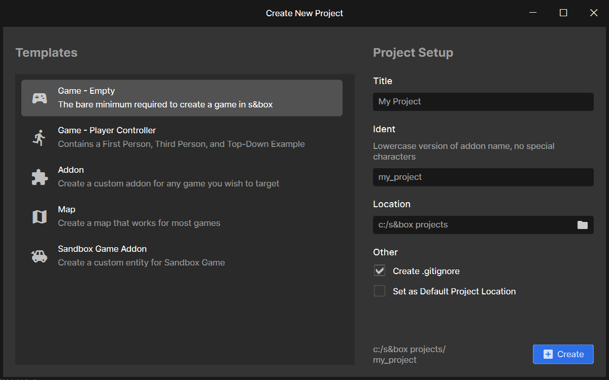

# Your First Project

The best way to learn is to do. Open the s&box editor and on the welcome screen, choose New Project. Create a Game - Empty project.

## Creating Game Objects

Once open you have an empty scene. You can experiment by creating GameObjects by right clicking the tree on the left, and selecting an object type to create.

## Creating Components

After that, try to **make a GameObject** that you can control by creating a custom component by selecting **Add Component** on the GameObject inspector and typing in a name. The file should open in Visual Studio.

## Player Input

Use the [Input section of this site](/gameplay/input/index.md) to figure out how to read keys, and change the `WorldPosition` depending on which keys are being pressed.

After that, maybe control the position of the camera too, either by parenting it to your object, or by setting the position directly using `Scene.Camera.WorldPosition`.

:::success
Congratulations - you just learned the basics of GameObjects and Components. You're a game developer now.
:::
