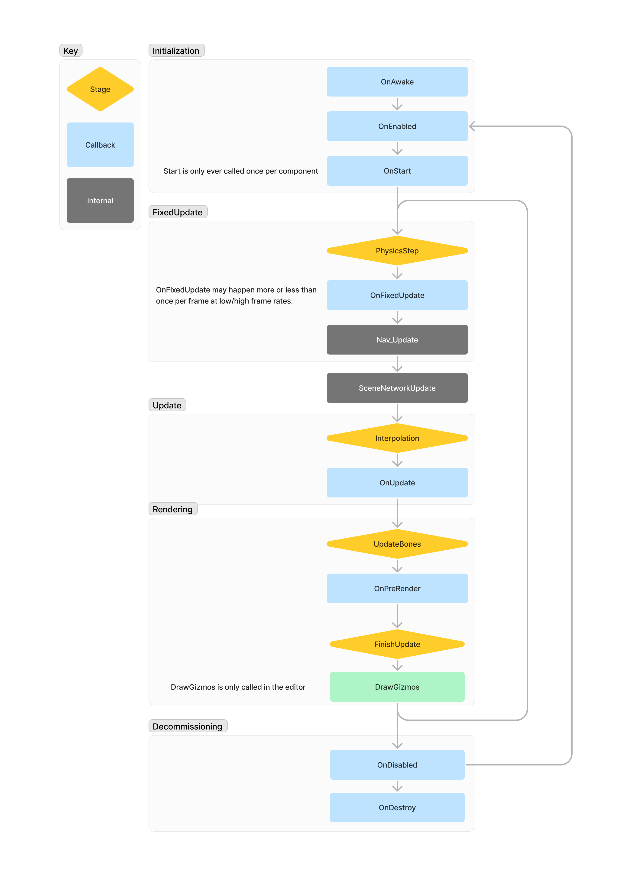

# Execution Order

:::warning
You should not rely on the order in which the same callback methods get invoked for different GameObjects, it is not predictable. If you need more control, you should use a [GameObjectSystem].

:::

# Flowchart

The flow chart shows the order of execution for a Scene, component methods are executed at the same time for all components. There are some internal methods added to make context clearer.

 
