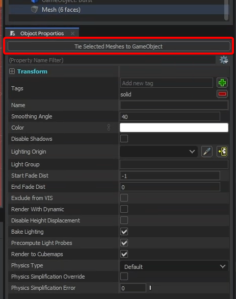

# Hammer Mesh

The HammerMesh component is added automatically to game objects in Hammer that are tied to a mesh.

You can't add these manually, you need to tie a Mesh to a GameObject by clicking the button in Hammer:

 

When maps are compiled the geometry is turned into a model and set on this component to be loaded at runtime. By default this component procedurally creates a ModelRenderer and a ModelCollider component using the generated model.

## Renderer

You can configure standard ModelRenderer properties here.

:::info
The renderer feature is optional. Right click on the renderer tab to disable it.

:::

## Collision

You can configure standard ModelCollider properties here.

:::info
The collision feature is optional. Right click on the collision tab to disable it.

:::
