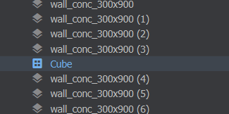

# Prefabs

A prefab is a GameObject that can be used in multiple places. They're usually used to contain an object that is used across multiple scenes, or needs to be instantiated at runtime.


# Assets

Prefabs are saved to disk as [PrefabFile]. These assets can be referenced in Components anywhere a [GameObject](/scene/gameobject.md) can be referenced. When the PrefabFile is updated, all instantiations of the prefab in scenes are updated, too.

To create a PrefabFile, right-click on a GameObject in the scene and select `Convert to Prefab`.


# In Scene

In the scene view, GameObjects that are instantiations of Prefabs are made obvious by their colour. 


 

When in their Prefab Instantiation state, they can't be edited significantly. You can't view or select objects in their hierarchy.

If you want to edit a prefab in the scene you can right-click it and choose `Unlink from Prefab` to change it to a bunch of normal GameObjects.


# In Code

To spawn Prefabs at runtime via code, you treat them like a regular GameObject. A GameObject property on your Component can be populated by dragging a PrefabFile into it.

```csharp
public sealed class MyGun : Component
{
	[Property] 
	GameObject BulletPrefab { get; set; }


	protected override void OnUpdate()
	{
        // throw an error if BulletPrefab wasn't defined
        Assert.NotNull( BulletPrefab );
        
		if ( Input.Pressed( "Attack1" ) )
		{
            // create a new instance of the bullet prefab at the gun's position
			GameObject bullet = BulletPrefab.Clone( WorldPosition );

			// bullet is now in the current scene, what do you want to do with it?
			// maybe get components and set the velocity or something?
		}
	}
}
```


Note that a cloned prefab will still be linked to the prefab. You can call `bullet.BreakFromPrefab()` to remove that link and have it appear as a normal stack of GameObjects if you want to.
