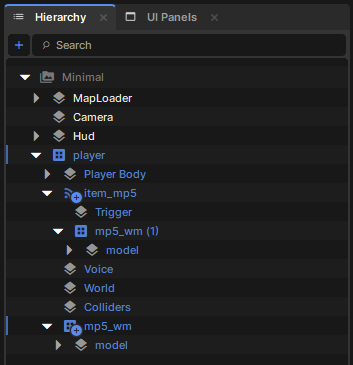
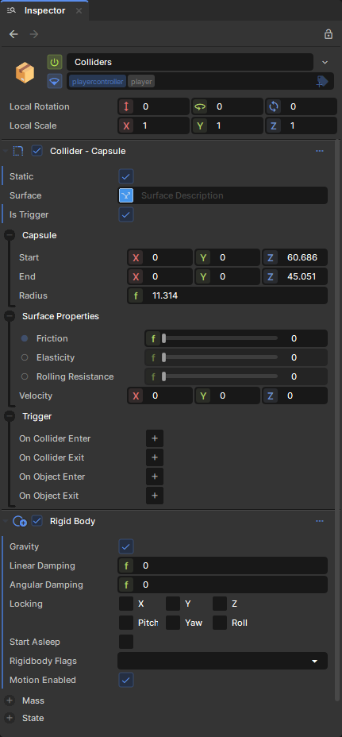
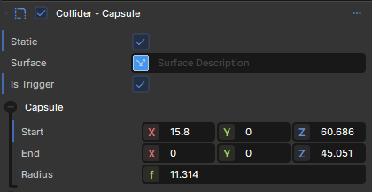
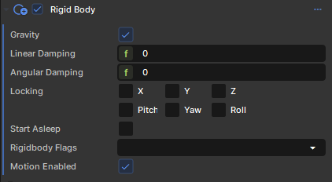
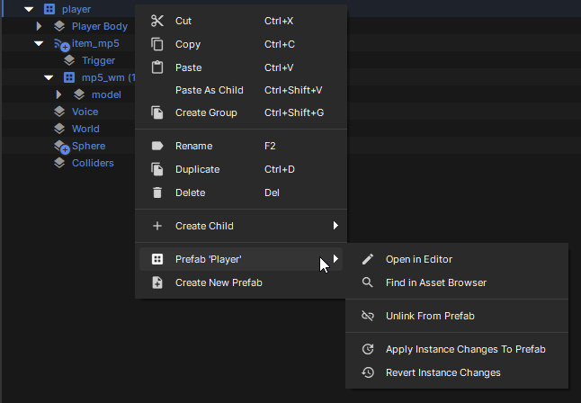
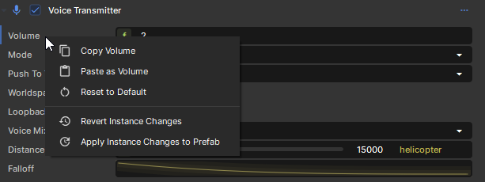
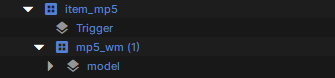

# Instance Overrides

Prefab instance overrides allow you to customize individual instances of a prefab without affecting the original prefab or other instances. This lets you create variations of the same prefab while maintaining the connection to the original template.

When you modify a property, add a component, or change the hierarchy of a prefab instance, these changes are stored as overrides. The instance remembers what's different from the original prefab while still receiving updates when the prefab itself changes.

# Visual Indicators

In the scene hierarchy, prefab instances with overrides are clearly marked to show their modified state.

 

Overridden properties and components are highlighted in the inspector, making it easy to see what's been customized on each instance.

 

# Types of Overrides

## Property Overrides

Change any property value on GameObjects or Components within the prefab instance. Position, rotation, scale, component properties, and GameObject settings can all be overridden.

 

## Component Additions

Add new components to GameObjects within the prefab instance. These components only exist on this specific instance.

 

## GameObject Additions

Add new child GameObjects to the prefab instance hierarchy. These children are unique to this instance.

 

# Managing Overrides

The inspector and scene hierarchy provides controls to manage overrides on individual properties and objects:

 

 

## Reverting Overrides

Right-click on any overridden property or object and select `Revert Override` to restore the original prefab value. You can also revert all overrides on a GameObject or the entire prefab instance.

## Applying Overrides

To make your instance changes permanent, right-click and select `Apply to Prefab`. This updates the original prefab with your changes, affecting all other instances.

# Nested Prefabs

When working with prefabs that contain other prefabs (nested prefabs), overrides work hierarchically. Changes to nested prefab instances are stored on the outermost prefab instance.

 

This ensures that all override data is centralized and properly managed even in complex prefab hierarchies.
