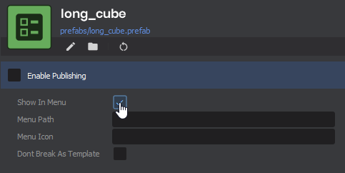
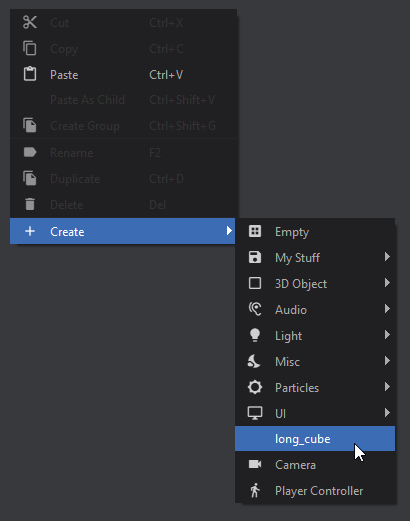
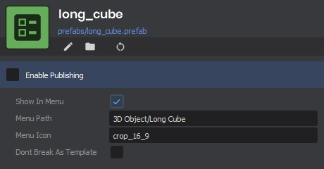
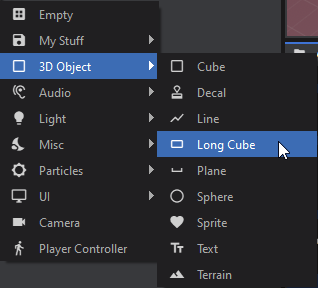

# Prefab Templates

If you want to add your own templates to the GameObject Create menu, it's as simple as enabling "Show In Menu" on a Prefab File:

 

Now you'll see your template as one of the options in the Create menu

 

You can make it look nicer by fiddling with the other variables, and even throw it in a sub-menu:

  

The final option is whether or not the prefab should be treated as a template. Templates will always break the prefab when created, otherwise the prefab reference will be maintained:

[DontBreakAsTemplate = false VS DontBreakAsTemplate = true
 508x544](./images/64c10c57-ce45-45bb-831f-b7885ab81d6f.png)
