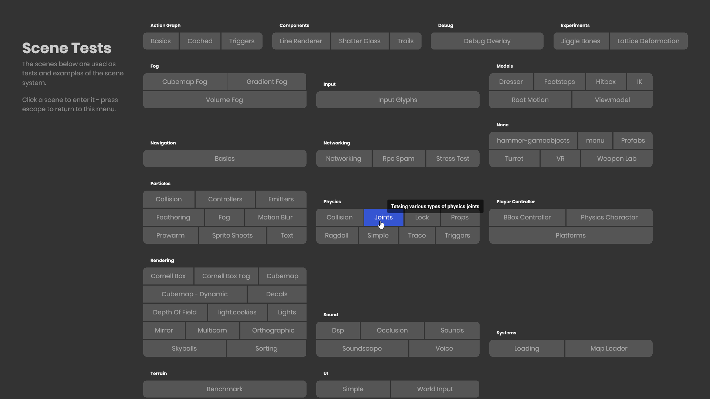

# Scene Metadata

You can implement the `ISceneMetadata` interface in any Component that has data you'd like saved to Metadata. Metadata is data that can be accessed without needing to load a Scene or clone a Prefab\n(accessed via either the `SceneFile` or `PrefabFile`)

## Component Example

```csharp
public class MySceneInfo : Component, ISceneMetadata
{
	[Property] public string Title { get; set; }
    [Property] public string Group { get; set; }
    [Property, TextArea] public string Description { get; set; }
    [Property] public int Difficulty { get; set; } = 1;

	public Dictionary<string, string> GetMetadata()
	{
        // Any data that can be serialized to a string can be stored here
		return new Dictionary<string, string>
        {
          { "Title", Title },
          { "Group", Group },
          { "Description", Description },
          { "Difficulty", Difficulty.ToString() }
        };
	}
}
```

This Component has `Title`, `Group`, and `Description` properties which are included in the returned Dictionary.

If you now save the Scene or Prefab containing this Component, it will serialize this information to the file.

## Reading Scene Metadata

Now we can call `GetMetadata(key, fallback)` on any SceneFile, so let's create a simple UI that lists out all our Scenes by Title and Group, showing the Description on hover:

```markup
@foreach( var group in ResourceLibrary.GetAll<SceneFile>().GroupBy( x => x.GetMetadata( "Group", "None" ) ) )
{
    <div class="group">
        <h1>@group.Key</h1>
        <div class="scenes">
            @foreach( var scene in group )
            {
                <div Tooltip=@( x.GetMetadata("Description") )>@( x.GetMetadata( "Title" ) )</div>
            }
        </div>
    </div>
}
```


 

## Reading Prefab Metadata

This is done identically to SceneFiles. If we had an "EnemyInfo" `ISceneMetadata` Component with `Difficulty` and `SpawnWeight` values, we could also spawn any PrefabFile in the current difficulty based on its weight (higher weight has a higher chance of spawning)

```csharp
void SpawnEnemy( Vector3 position, int difficulty )
{
    var allEnemies = ResourceLibrary.GetAll<PrefabFile>().Where( x => int.Parse( x.GetMetadata( "Difficulty", "0" ) ) <= difficulty );
    float totalChance = allEnemies.Sum( x => float.Parse( x.GetMetadata( "SpawnWeight", "0" ) ) );
    float randomChance = Random.Shared.Float( 0, totalChance );
    float runningChance = 0f;
    foreach( var enemy in allEnemies )
    {
        runningChance += float.Parse( enemy.GetMetadata( "SpawnWeight", "0" ) );
        if( randomChance <= runningChance )
        {
            var prefab = SceneUtility.GetPrefabScene( enemy );
            prefab.Clone( position );
            break;
        }
    }
}
```
