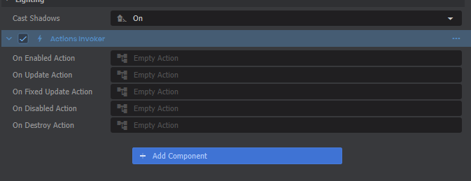

# Component Actions

The easiest way to add an *ActionGraph* to your scene is through the Actions Invoker component. Just click Add Component on an object, then you can find it under Actions.

 You can also find action properties in a few other built-in components, like *Colliders* when *Is Trigger* is checked.

 

Each of these start out with an "Empty Action". Simply click on any of those to create a new ActionGraph and start editing it!

 

## Next Steps

Take a look at the [Intro to ActionGraphs](/systems/actiongraph/intro-to-actiongraphs.md) guide to learn how to edit your new graph.
