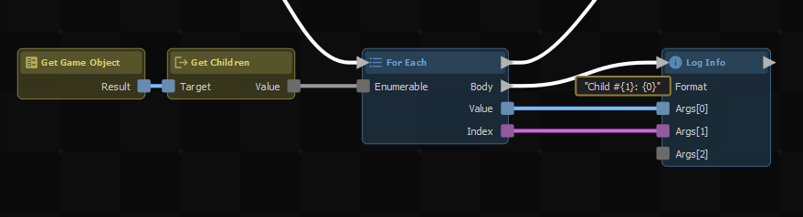
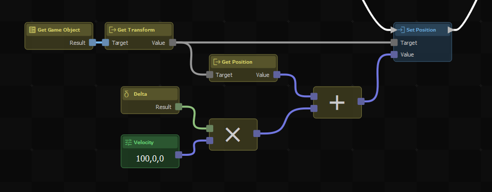

# Examples

Here's how to do some common things. Each has a code you can copy to your clipboard, then Ctrl+V to paste in the ActionGraph editor.

## Loop Through Child Objects

 

### Clipboard Code

```none
actiongraph:H4sIAAAAAAAACp1UW0+DMBR+X7L/0OArQ5huGb4ZTcyi0SVeXoxZCpyxKrSkLWbLwn+3pbjVMc3w6XBu3/nOhW76PYScW0IT5wI5l7EkjDpubXzBnOAoA6E8r2/Gds8So2sNoY0RyjHV+aOJuzU8rQvQkCIGCl4KkkXvEEtnF/EsgF9jiVXUFkeZZ0yQmoVKHozGvjs4G0+c74DKfFTuYQJhm0DBWQFcrjUHq/rMmEndjl1/LpvER0yTiK28G5zDqa087HWik6iy66SrJckSDnRHuFvD536nhtV4Wg0vGAccLztOOgiHnQoH7cIZSz1CF8yqPKVFKfcnrAjmWG6nhU42QaUi/OqfQwuGk8PUtWgO947QD+twG4F+nOycgygza7H2OUnM9QEZ3YDaMOEfMPaSgJY5cP1b/QZlR0csWVs41szngqQUZ8eCeJ84K+EwlGpM7Dz+sYjqyYDVMYhBg1hvo9+rvgCTVPEacwQAAA==
```


## Move With Velocity

 

### Clipboard Code

```none
actiongraph:H4sIAAAAAAAACr1U30+DMBB+X7L/gfDMENjGmG8mJsZodIlzL8YsBaqpQkvabnFZ9r/b0g2qDALzR3govet9333t3W37PcMwbxCOzXPDvIg4Iti0cuMCUATCBDLheXpWtjsSq73cGcZWLcJxLeP9sVUY5psMSkgWQQztV8hJ+AYjbpYnHhmkl4ADcarAEeYZYSjPQgQPxl5gDRzz4N6pn511nN6v0meUZJDyjcxA454pM8rF6OxLvg98ADgOyYd9BVJ4pm/uv+mQQVjYZdCcAsxeCE3LjLvpHfpd9E4a9LLf0ltqOiq5SP80xZ4TWK31Bv/xvn+rd+D6juWP2iqeVhWTzAZx3K2PRoHlekFL0olTJeUohXYME8HSsaCHfhdq96jedJVwlCUbs/tVu1OvLbdX5Y4IZtxew2jYprYOJbKACYkQ19IVzjVIVrnXdRxLfCdPCHGhnlctILnsh/Qtwu/akN4vxpfxvKSQiVstU9SHJwdUtpPaK1Adxm+C0WbST2CC1jBBE4zWP6AWQTvUqEc9YQ2K3jUVFL2ua/PQDzUqCWsRtBJuzKFAyKum39t9Ai3avLMHCAAA
```
