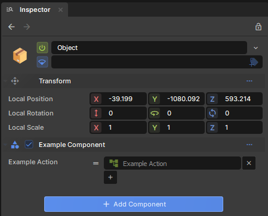
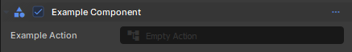
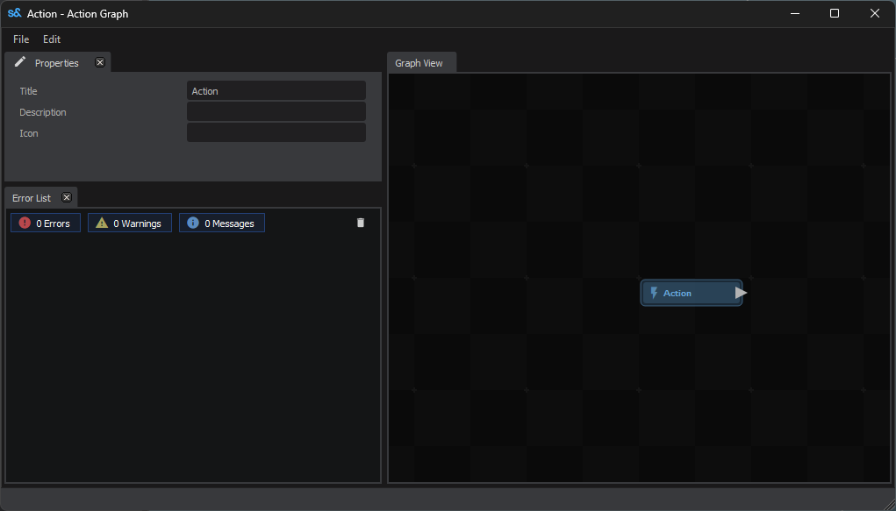
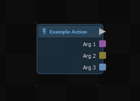
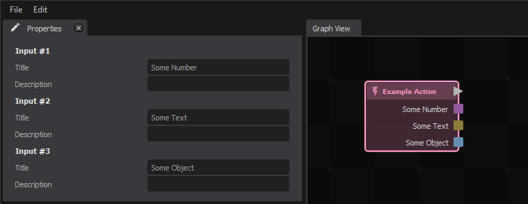
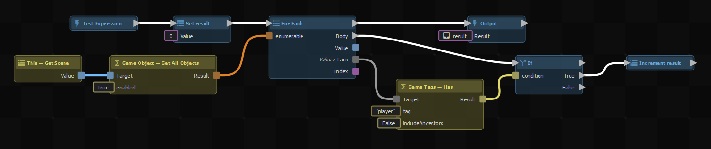

# Using With C#

Here's how you can use ActionGraph with your game code written in C#.

```csharp
public class ExampleComponent : Component
{
	[Property]
	public Action ExampleAction { get; set; }

	protected override void OnUpdate()
	{
		if ( Input.Down( "attack1" ) )
		{
			ExampleAction?.Invoke();
		}
	}
}
```


## Declaring the Property

```csharp
[Property]
public Action ExampleAction { get; set; }
```

This will add a property that we can see in the inspector. For a property to be usable as an ActionGraph it must have a [Delegate](https://learn.microsoft.com/en-us/dotnet/csharp/programming-guide/delegates/) type. We're using the type [Action](https://learn.microsoft.com/en-us/dotnet/api/system.action?view=net-8.0) here, which takes in no parameters and returns nothing. Once we do this we can press the "+" to add as many callbacks to the Action as we want.

 

If you only intend to have one callback for your Delegate, you can add the \[SingleAction\] attribute and it will show only the one action in-line without having the option to add/remove others.

 

Clicking on the Example Action or Empty Action will open the ActionGraph editor and start editing it.

 

### Adding Parameters

If you want to be able to pass in some parameters, you can use a different delegate type:

```csharp
[Property]
public Action<int, string, GameObject> ExampleAction { get; set; }
```

Opening up the graph, you'll see the root node has a socket for each parameter type, in the order you declared them.

 

### Renaming Parameters

There's a couple of ways to rename the parameters, since "Arg 1", "Arg 2" isn't very helpful. First, you can click on the root node in the editor, and change the socket names and descriptions in the Properties panel.


 

The other way is to use a custom delegate type:

```csharp
public delegate void ExampleDelegate( int someNumber, string someText, GameObject someObject );

[Property]
public ExampleDelegate ExampleAction { get; set; }
```

This will automatically fill in the names of each parameter like above, and you can re-use the same delegate type for any property that would take in the same set of parameters.


## Running an ActionGraph

You can call the property like any other method directly:

```csharp
ExampleAction();
```

However, if the action hasn't been created in the editor yet, this will throw a `NullReferenceException`. A safer way to run it is to check for null like this:

```csharp
ExampleAction?.Invoke();
```

This is shorthand for:

```csharp
if ( ExampleAction is not null ) ExampleAction();
```


### Passing in Arguments

If you've declared some parameters, you can pass in values when running the graph like this:

```csharp
ExampleAction( 123, "Hello, World!", GameObject.Parent );
```

Or if you're checking for null:

```csharp
ExampleAction?.Invoke( 123, "Hello, World!", GameObject.Parent );
```


### Returning Values

Delegates with return types are supported too.

```csharp
[Property]
public Func<int> TestExpression { get; set; }
```

Graphs implementing delegates like this will have an Output node, which you'll need to connect to the input without going through any async nodes (like delays).


 

## Async Graphs

If you want to wait for a graph with delays to finish running, it needs to be declared with a delegate type that returns a [Task](https://learn.microsoft.com/en-us/dotnet/api/system.threading.tasks.task?view=net-8.0).

```csharp
[Property]
public Func<Task> ExampleAction { get; set; }
```

With parameters:

```csharp
[Property]
public Func<int, string, GameObject, Task> ExampleAction { get; set; }
```

As a custom delegate type:

```csharp
public delegate Task ExampleDelegate( int someNumber, string someText, GameObject someObject );

[Property]
public ExampleDelegate ExampleAction { get; set; }
```

When you call it you can either `await` the returned task, or use [ContinueWith](https://learn.microsoft.com/en-us/dotnet/api/system.threading.tasks.task.continuewith?view=net-8.0) outside of `async` code.

```csharp
await ExampleAction( 123, "Hello, World!", GameObject.Parent );
```

```csharp
ExampleAction?.Invoke( 123, "Hello, World!", GameObject.Parent )
    .ContinueWith( task => { } );
```


## Next Steps

Take a look at the [Intro to ActionGraphs](/systems/actiongraph/intro-to-actiongraphs.md) guide to learn how to edit your new graph.
