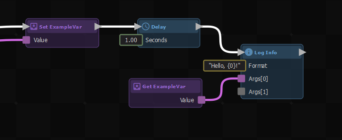
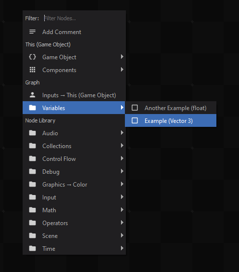

# Variables

Variables are useful for making your graph easier to understand, cleaning up link spaghetti, and when performing calculations in loops.

 

You can create a new variable by dragging a link from an output with the value type you want the variable to hold, selecting "Add Variable", then giving it a name.

 

This will create an action node that sets the new variable upon receiving an input signal. You can then create more nodes to get or set the value of the variable by righ-clicking, then looking under *Variables*.

 

You can also directly use a variable in an input socket by right-clicking on it, then selecting the variable from the context menu.

 
