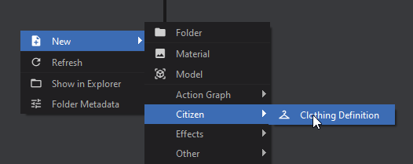

# Custom Assets

You can define your own custom asset types as GameResources. They give you a nice inspector window and they're hotloaded in-game, which means you can whip things up pretty quickly if you're using them.

# Creating a custom asset type

You can find plenty of examples of assets throughout s&box, here's a snippet from a clothing asset:

```csharp
// Custom Asset named "Clothing Definition" with the extension ".clothing"
[AssetType( Name = "Clothing Definition", Extension = "clothing", Category = "citizen" )]
public partial class Clothing : GameResource
{
	public string Title { get; set; }

	[ResourceType( "vmdl" )]
	public string Model { get; set; }

	[Hide]
	public int Amount { get; set; }

	[JsonIgnore]
	public int MySecretNumber => 10;

	protected override Bitmap CreateAssetTypeIcon( int width, int height )
	{
		return CreateSimpleAssetTypeIcon( "checkroom", width, height, "#fdea60", "black" );
	}
}
```

It is important to note:

* You should ensure that your **filetype is all lowercase** and **less than or equal to 8 characters**, otherwise it will fail to register/save
* These are just JSON files with pretty faces and file types easy for the game to locate (and for developers to work with)

# Creating a new Asset for your GameResource

Now that you've created the GameResource class, it should automatically be added to the "New" menu in the Asset Browser. If you didn't specify a Category, then it will show under "Other".

 

# Accessing Assets

All assets are loaded when you first start the game, and there are several ways you can access them:

### ResourceLibrary.Get<T>

```csharp
// Load the resource from a path
// If the asset isn't found, this returns null
Clothing = ResourceLibrary.Get<Clothing>( "config/tshirt.clothing" );
```

### ResourceLibrary.TryGet<T>

```csharp
// Serves a similar purpose to Get<T> but returns a bool indicating
// whether the resource could be found. If the resource was found,
// the method provides it through an `out` parameter.
if( ResourceLibrary.TryGet<Clothing>( "config/tshirt.clothing", out var loadedClothing ) )
{
  Clothing = loadedClothing;
}
else
{
  // Resource couldn't be found, handle that here...
}
```

### PostLoad

When assets are loaded they call their `PostLoad` method. You can use this to store a list of your assets.

```csharp
public partial class Clothing : GameResource
{
	// Access these statically with Clothing.All
	public static IReadOnlyList<Clothing> All => _all;
	internal static List<Clothing> _all = new();

	protected override void PostLoad()
	{
		base.PostLoad();

        // Since you are constructing the list yourself, you could add your own logic here
        // to create lists for All, AllHats, AllShirts, AllShoes, ect.
		if ( !_all.Contains( this ) )
			_all.Add( this );
	}
}
```

# Attributes

You can use any of the [Attributes](/editor/property-attributes.md) you'd normally use on Properties (just like Components)
