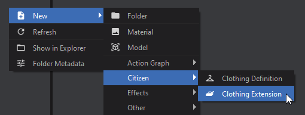
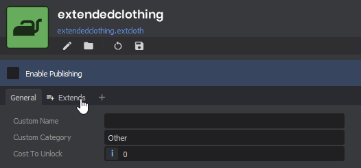
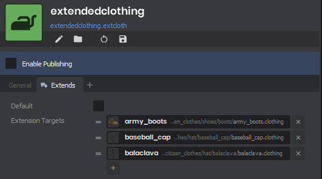

# GameResource Extensions

ResourceExtensions can be used to append additional data to existing GameResources without modifying the original class or assets. This is useful for adding additional properties to resources such as Clothing, Surfaces, Models, ect.

# Creating a ResourceExtension

You create a ResourceExtension very similarly to any other GameResource, here's an example:

```csharp
[GameResource("Clothing Extension", "extcloth", "Extra Clothing Stuff", Category = "Citizen", Icon = "iron")]
public class ClothingExtension : ResourceExtension<Clothing, ClothingExtension>
{
    public string CustomName { get; set; }
    public string CustomCategory { get; set; } = "Other";
    public int CostToUnlock { get; set; } = 100;
}
```

In `ResourceExtension<Clothing, ClothingExtension>`, `Clothing` is the resource you are extending.

# Extending Assets with your ResourceExtension

You can now create your asset extension the same way you would create a new Asset

  


Once you've set up your extension with the desired values, you can go to the "Extends" tab to specify which Assets this resource should be extending. All specified assets will be able to access this extension.

 If "Default" is enabled, then this ResourceExtension will be returned as the default for any Asset without a corresponding extension. 

# Accessing a ResourceExtension

### FindForResourceOrDefault( Resource r )

```csharp
// This will return the ResourceExtension marked as "Default" if the resource doesn't have one
var clothingExtension = ClothingExtension.FindForResourceOrDefault( PlayerHat );

Log.Info( $"The cost of the hat is {clothingExtension.CostToUnlock});
```

### FindForResource( Resource r )

```csharp
// This will return null if the resource doesn't have a ResourceExtension
var clothingExtension = ClothingExtension.FindForResource( PlayerHat );

if ( clothingExtension is not null )
{
  Log.Info( $"The cost of the hat is {clothingExtension.CostToUnlock});
}
else
{
  // Handle extension not existing...
}
```

### FindAllForResource( Resource r )

```csharp
// This will return all ResourceExtension of your type that target the specified resource
// This will NOT return the default unless the default happens to also target the resource
var allExtensions = ClothingExtension.FindAllForResource( PlayerHat )

foreach ( var extension in allExtension )
{
  Log.Info( $"The cost of the hat is {clothingExtension.CostToUnlock});
}
```

### FindDefault()

```csharp
// This will return the ResourceExtension marked as "Default" if one exists
var defaultExtension = ClothingExtension.FindDefault()

Log.Info( $"The default cost is {defaultExtension.CostToUnlock}" );
```
