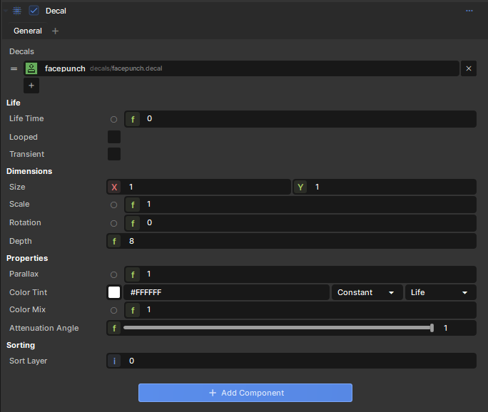

# Decal Component

The decal component draws a decal in the game world.

 

The component is set up so you can create variety in your prefab decals without any extra coding. For example, you can define multiple DecalDefinitions and it'll choose one at random.

## Randomizing

Certain properties can be animated, but you can use this same functionality to randomize too.

For example, you can set rotation to be a range from 0 to 360, in which case when it spawns it'll choose a number between those at random. 

This allows you to create variety and avoid patterns, but in a controlled way without requiring code.
