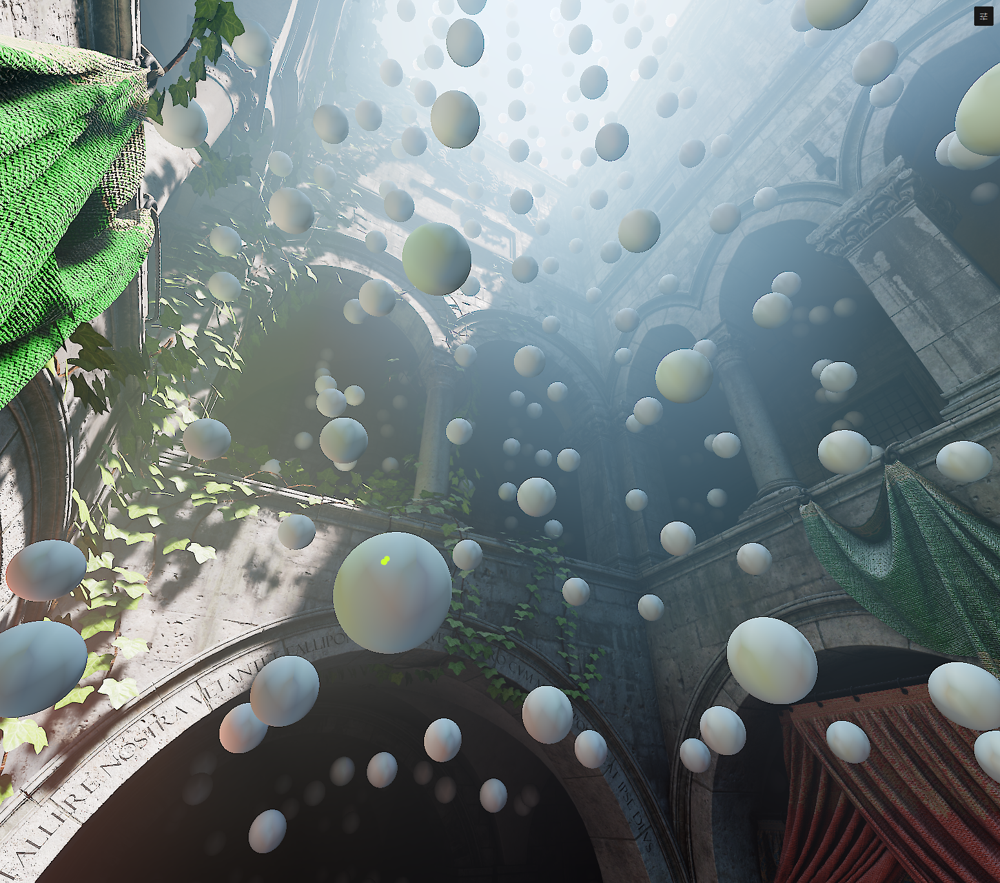

# Indirect Light Volumes

Indirect Light Volumes are in Feedback Preview

 

# About

A grid of probes samples indirect light from all directions throughout the volume. When rendering, the system interpolates between nearby probes to shade each point. 

Light bouncing off a red wall will tint nearby surfaces; sunlight from a window will fade naturally into a room.

Probes also store visibility, the distance to nearby surfaces, so this helps dealing with more detail and leaks even in sparse density.

# Properties

* ### Probe Density

  How tightly packed the probes are. More probes = finer detail, but costs more. Crank it up for tight spaces, keep it low for big open areas.

  ### Normal Bias

  Pushes sample points away from surfaces. If you're getting dark speckles or self-shadowing artifacts, bump this up.

  ### Contrast

  Makes the bounces punchier. Higher values crush the darks, looks more dramatic and stylized.

  ### Inside Geometry Behaviour

  Whether to remove probes that are detected inside of backfacing geometry and not interpolating them or pushing them to a better position.

  Preferred to disable them, pure relocation can cause interpolation artifacts but higher density, preference up to the artist.

# Best practices

* Position volumes to cover key areas without overlap.
* Bake after major scene changes.
* In open areas, use low density probes, and add a second volume for more detail in a specific region
* Ideally use thicker wall geometry, use a second volume if visibility isn't enough to cover them.

## Limitations

**Thin walls leak light.** The probe grid can't see walls thinner than the probe spacing. Thicken your geometry, increase density or use multiple volumes.

**Not Real-Time.** Baking happens in the editor for now; no dynamic updates at runtime. Re-bake for scene changes.
