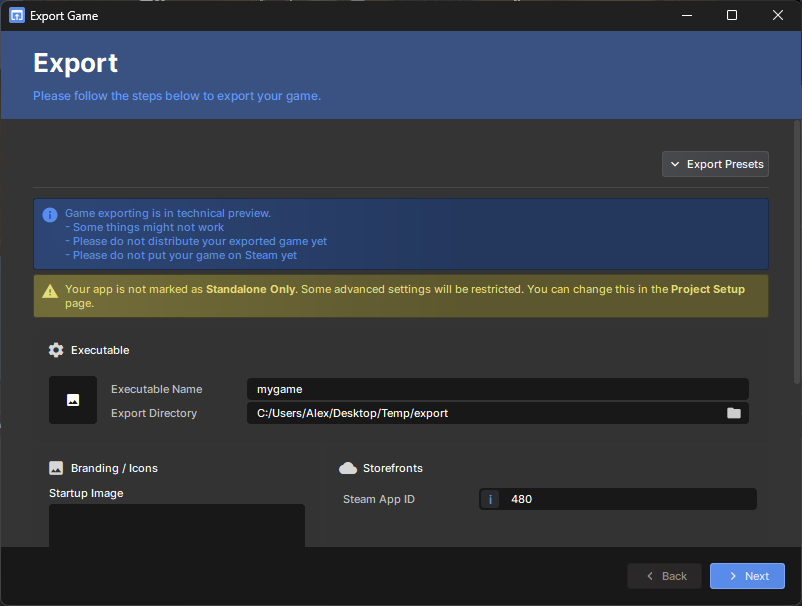

# Game Exporting

:::warning
You can export your game, but you shouldn't distribute your exported game just yet.

:::

You can choose to export your games as executables, so that you can put them on other storefronts directly - e.g. Steam.

These games don't have the typical restrictions that platform games have - there's no whitelist for code, and you can use standalone-exclusive APIs.

Games are compiled with an extra `STANDALONE` constant when exporting.
```csharp
#if STANDALONE
//code that should only run in an exported game
#endif
```

## How to Export your Game

Exporting your game is done through the Export Wizard.

 

To access the wizard:


1. Click on the "Project" menu
2. Click "Export…"
3. Add an icon and a splash screen if you want, if you're exporting to Steam then insert your App ID
4. Click 'Next', wait for the project to export
5. Your project's executable will be in the folder you selected in Step 3. You can click "Open Folder" to open the folder containing your game, and double click the exe to play it.

## Restrictions

The following restrictions apply to all games that are exported from s&box:

* Your game must be put on Steam (it can be on other storefronts too, but Steam is a hard requirement)
