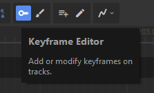

# Keyframe Editing

This is the simplest way to describe how stuff in your scene should animate. Create keyframes in property tracks that are snapshots for what values that track should have at specific times, then control how the track should blend between those values.

It will be active by default, but you can toggle it with the key-shaped button in the toolbar.

## Creating Keyframes

There's three ways to create a keyframe for a property track:

* Change the property that the track is bound to, a keyframe is created at the current playhead time
* Right-click on the track in the timeline, and select *Create Keyframe* in the context menu
* Toggle *Create Keyframe on Click* either by holding Shift or pressing the button in the toolbar, then clicking in the timeline

  \

[sbox-dev_iAf40itXRB.mp4 1008x896](./images/982b6a59-ff9b-4add-9dcd-81ac69bc2788.png)

:::tip
Copy the scene view's perspective into a selected camera with Ctrl+Shift+F

:::

## Interpolation Mode

Each keyframe can choose between three different interpolation modes:

* Linear - change at a constant velocity
* Quadratic - ease in / out, with 0 velocity at the keyframe
* Cubic - move along a smooth spline connecting keyframes

[sbox-dev_6y9byeniJF.mp4 1008x896](./images/e7b43e8c-ee83-4270-8ede-456998247169.png)

You can combine different modes for neighbouring keyframes to make animations ease in or out.

[sbox-dev_ThsOOsr9bq.mp4 1008x896](./images/2d7c2b3a-4b73-4e56-8b0c-2df9e797fd02.png)

## Automatic Track Creation

For convenience, you can enable this mode to create tracks whenever you touch something in the scene. This helps the most when you're changing lots of properties on many objects, so you don't have to manually created dozens of tracks.

[sbox-dev_yRfCXPdJl1.mp4 1482x896](./images/1962da73-e84b-48e6-a904-272034bf9617.png)
