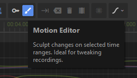
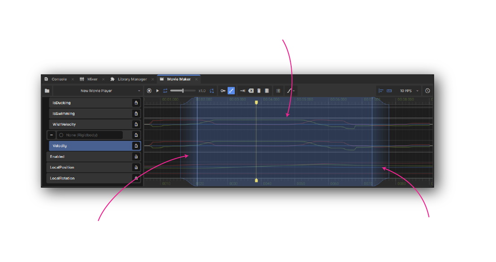
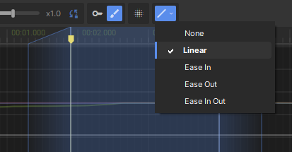
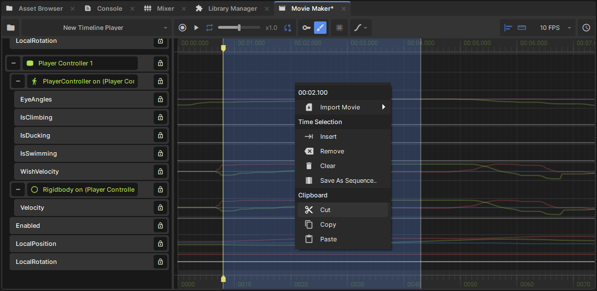
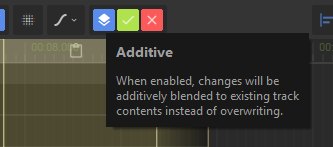

# Motion Editing

This editor mode gives you finer control over track data. Instead of keyframes, you sculpt the raw track data itself at any resolution you want.

To motion edit, you select a time range of one or more tracks, then tweak the properties that those tracks represent to manipulate track data. You can also cut / copy / paste ranges of time, or save the selection as a separate .movie file.

# Time Range Selection

A time range selection describes how much a modification affects each moment in time. It's broken up into three parts:

* **Fade In** - modifications gradually ramp up within this range
* **Peak Range** - times in this range are fully affected by modifications
* **Fade Out** - modifications ramp down within this range

 To make and update a selection:

* Click and drag in the timeline to select a time range
* Hold *Shift* and scroll to increase / decrease the fade in / out time
* Drag any of the parts of a time range to move or resize them
* Use *Ctrl+A* to select the whole movie's duration
* Press *Esc* to clear the selection

[sbox-dev_Ut0CxWvmsX.mp4 1170x462](./images/14b2ba33-d1e5-4033-b042-9e78208937b2.png)

You can change the easing type of the fade in / out sections with the corresponding button in the toolbar, or pressing number keys when mousing over those sections. The shape of the top / bottom of the time selection UI shows what the current easing function looks like.

 

# Modifications

After selecting a time range, you can manipulate the properties of your movie's tracks. Only the selected time range will be affected, with the changes ramping up and down inside the fade in / out sections of your selection.

[sbox-dev_6msI738i7O.mp4 1170x884](./images/db75566e-976c-4cdb-9a4b-efa5e8848ef8.png)

The selection will turn yellow to show a modification is in progress. At this point you can freely tweak the time selection, and when you're happy hit *Enter* or click the green tick to commit the change.

# Context Menu

The context menu for time selections has a ton of extra editing actions.

 

### Time Selection Actions

* **Insert** (*Tab*) - add empty time inside the selected range, moving existing track data to the right
* **Remove** (*Backspace*) - delete the selected range, moving everything afterwards to the left
* **Clear** (*Delete*) - delete the selected range, leaving empty time
* **Save As Sequence..** - save the selected range to a .movie, and reference it in the current project

### Clipboard Actions

* **Cut** (*Ctrl+X*) - copy the selected range to the clipboard, then clear the range
* **Copy** (*Ctrl+C*) - copy the selected range to the clipboard
* **Paste** (*Ctrl+V*) - paste previously copied track data as a modification

#  Additive Editing

When pasting a time selection, you can additively layer track data over the existing animation. This is enabled by default, can can be disabled by clicking the *Additive* button in the toolbar while modifications are active.

[sbox-dev_d1eWXxyK4J.mp4 1052x1062](./images/87194b81-3559-46aa-b719-dbeb307da29c.png)
