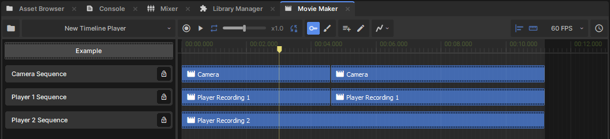
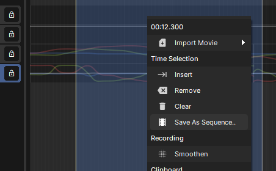
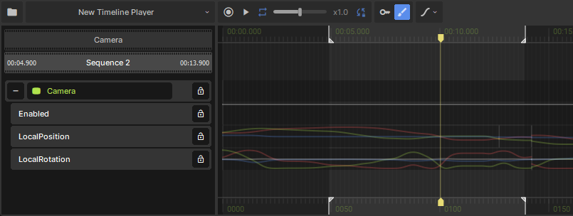
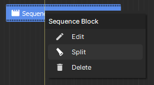

# Sequences

Sequence blocks are clips taken from other .movie assets. This helps you divide up big projects however you like: individual scenes, or individual actors in each scene can be grouped into their own .movie files. There's no limit to how deep you nest your sequences.

Sequence blocks also give you a convenient way to edit your movie. You can move them around in the timeline, or clip their start and end times without editing raw track data. Multiple sequence blocks can reference the same source .movie, so you can edit down a long recording into just the action you need.

#  Creating Sequences

Any project saved as a .movie resource (in the file menu) can be used as a sequence.

If you want to split your existing movie into multiple sequences:

1. Switch to the [Motion Editor](/systems/movie-maker/motion-editing.md)
2. Select the time range you want to save as a sequence
3. Select *Save As Sequence..* in the context menu

# Importing Sequences

Both the file menu and timeline context menus have an *Import Movie* option. After selecting a movie, a new sequence block will be created with the duration of the referenced clip.

# Editing Sequence Blocks

Sequence blocks can be moved and resized with the mouse. Multi-selecting sequence blocks lets you move them together, and if their starts or ends align you can drag those together too.

[sbox-dev_q8AjPLuIie.mp4 1056x338](./images/e564880f-2180-45bb-bb67-286864b6073e.png)

Double-clicking on a sequence block will start editing the referenced movie, with the sequence block's time range highlighted in the timeline. The top of the track list will show you how the current project is nested, and you can return to outer movies by clicking them there.

 

#  Splitting Sequence Blocks

Split a sequence block by right-clicking on it at the time you want to create the cut, then selecting *Split*. This will give you two blocks, which you can move and resize as you wish.
