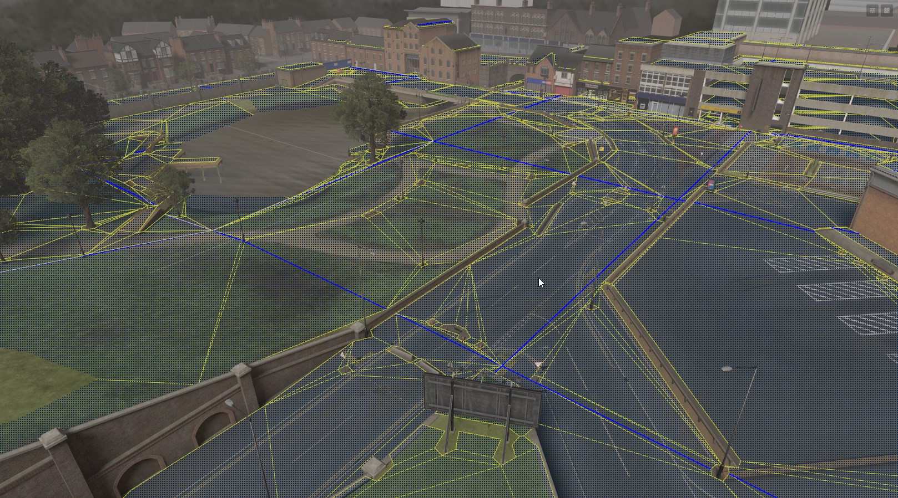

# Navigation

We implement [Recast Navigation](https://github.com/recastnavigation/recastnavigation) in s&box, the industry standard for navmesh generation and navigation agents. It's used in Unreal, Unity and Godot. So if it seems familiar, that's why.\n

 


# What is a NavMesh?

A NavMesh is a simplified map of traversable areas in a game world, designed to help AI with pathfinding and movement. NavMeshes are created from the game's **PhysicsWorld**, which defines where AI characters are allowed to move.

## Understanding NavMesh Limitations

A NavMesh **is not** a detailed or precise representation of the game world; rather, it is a simplified abstraction focused solely on navigable areas. **It lacks exact height information** or precise ground geometry. Use the PhysiscsWorld alongside the NavMesh, for interactions that require specific physical details, such as placing the game object on the ground.

# Creating a NavMesh

To create a NavMesh in your scene, just click the Enable NavMesh button in the header.

 

You can toggle viewing the generated mesh by clicking the button next to it.


[When the mesh is visible, it will update live in the scene editor 1698x940](./images/da841df9-5780-4e07-a824-5c658ef550ee.png)


The NavMeshis split up into multiple smaller tiles. The ==yellow== lines represent regular polygon boundaries, while the ==blue== lines represent polygon borders that are also tile boundaries.


# NavMesh Settings

You can edit further NavMesh settings by clicking the pencil and paper icon in the NavMesh group in the header.

 

This allows you to adjust the properties of the mesh, like how steep slopes can be. You can also filter which physics objects are used when generating the mesh.


# Code

The navmesh is accessible at `Scene.NavMesh`.

```csharp
// Get a random position anywhere the navmesh
var pos = Scene.NavMesh.GetRandomPoint();

// Get a random position within radius of testposition
var pos = Scene.NavMesh.GetRandomPoint( testposition, radius );

// Get the closest point on the navmesh from another position
var pos = Scene.NavMesh.GetClosestPoint( testposition );

// Get the closest edge of the navmesg from this position
var pos = Scene.NavMesh.GetClosestEdge( testposition );

// Get a path from one position to another
var path = Scene.NavMesh.CalculatePath( new CalculatePathRequest()
{
	Agent = Agent, // Optional agent to use for parameters
    Start = WorldPosition,
    Target = TargetWorldPosition
} );

// Path.Status is either Complete or Partial
if ( path.IsValid() ) // ...

// Mark the navmesh dirty, so it will be rebuilt in the background
Scene.NavMesh.SetDirty();
```
