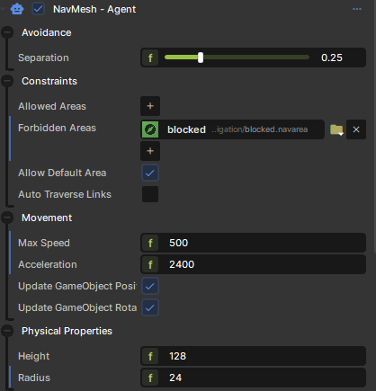

# NavMesh Agent

A NavMesh Agent will move from position to position on the NavMesh, automatically. It features crowd control features, so they will try to avoid bumping into each other if possible.


[Crowd of agents moving to the same target. 1698x918](./images/4b9429ba-ae3d-4c4e-b255-6fa4115c31fb.png)


# Component

 

The NavMeshAgent is implemented as a component. When you add it to your GameObject it can take over control of the position and rotation.


You would usually create another component, for your main AI logic, which will set positions and animate a model based on its velocity. It's not unusual for this custom AI component to change the max speed and acceleration as it reaches goals etc.

# Code

```csharp
NavMeshAgent agent = ...

// Sets the target position for the agent. It will try to get there
// until you tell it to stop.
agent.MoveTo( targetPosition );

// Stop trying to get to the target position.
agent.Stop();

// The agent's actual velocity
var velocity = agent.Velocity;
```
