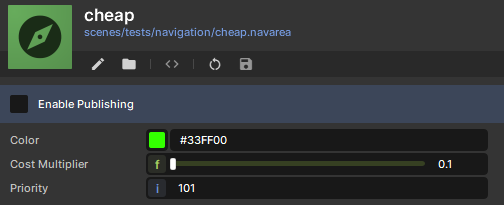
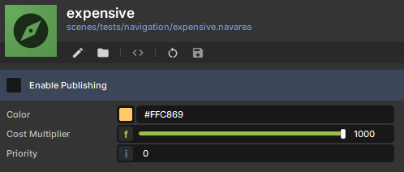
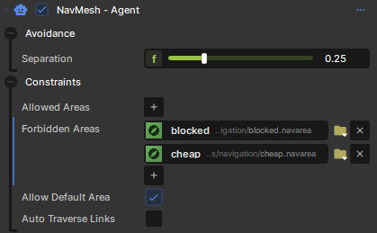
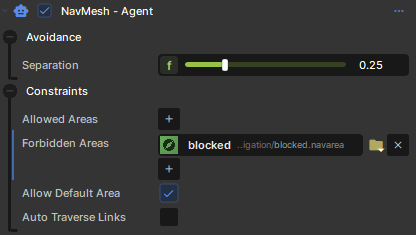

# Costs & Filters

Areas can be used:

* to mark a section as more costly to traverse than others (e.g. shallow water)
* to prevent certain agents from entering a specific area

[Nav Area impacting agent Pathing behavior 728x334](./images/d03a480c-c9f5-465a-a00f-02f9cfb9368c.png)

Nav Area impacting agent Pathing behavior

# Costs

[Agent preferring the cheap area (green) over the expensive area (orange). 728x327](./images/a09e76fb-9641-4346-a220-6e05ccddfc42.png)

Agent preferring the cheap area (green) over the expensive area (orange).

 

 

# Filters

By default an agent can traverse any area.

But, you can also specify which areas an agent is allowed to travers and which not.

[Maze made of Forbidden areas, one agent can take shortcuts in the maze. 738x728](./images/4adcaef9-bda1-4bf8-ae82-2c41cf01025c.png)

Maze made of Forbidden areas, one agent can take shortcuts in the maze.

 

Regular Agent

 

Shortcutter Agent
