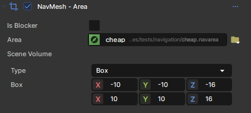
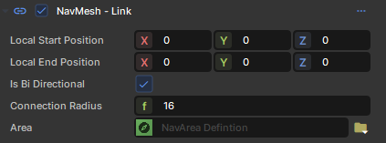
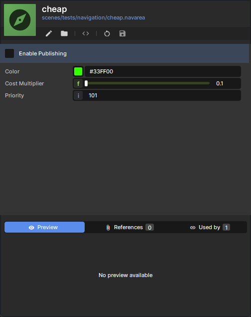

# NavMesh Areas

NavNesh Areas can affect NavNesh generation and agent behavior/pathing.\n The NavMeshArea component is used to define the location, shape and type of an area.

 

You can also specify the Area for a link component.

 The NavMeshAreaDefinition resource is used to define properties of the Area.

# Limitations

* Currently there is a limit of 24 NavMeshAreaDefinition, but you can assign them to as many Area Components as you like
* **Static** areas are basically free.
* **Moving** areas are a bit more expensive, but you should be able to have at least a couple of dozens of them.
