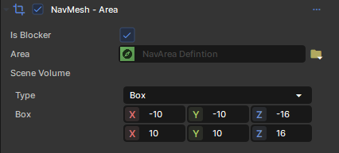

# Obstacles

Areas can be used to block of certain areas of the NavNesh both in editor and at runtime. This will completely omit an area from navmesh generation.\n\nObstacles can be created by creating a NavMesh Area Component, enabling the `IsBlocker` flag.

 

## Examples

[null 1920x1078](./images/a98e4518-face-474b-abd2-aa6af9bf4f78.png)

[null 1920x1078](./images/f79e554d-a5e3-47ae-9328-eb20b5352802.png)
