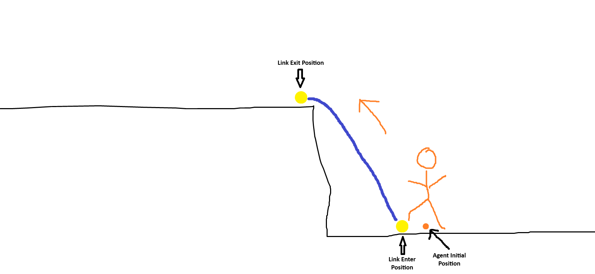

# NavMesh Links

[Testbed demo scene showing agents traversing links. 1958x950](./images/8359864a-8ea3-417f-aed3-29f827a14264.png)

# Creating Links

You can create links by adding a NavMeshLink Component to an GameObject.


[You can manually edit the properties via the inspector or you can use the editor tools. 1698x828](./images/3128d145-6887-465d-b75d-a58c4fae2215.png)

# Agent Link Traversal

## Default Traversal

By default agents will linearly interpolate between start/end locations to travers the links.

[Default traversal, agent's simply "fly" across the links. 1698x922](./images/7572ce03-aba8-4597-9ac0-318a3daf8ee6.png)

We provide virtual functions you can override and events you can subscribe to in order to be informed about agent traversal.\n\nCustom NavMeshLinkComponent:

```csharp
public sealed class CustomLink : NavMeshLink
{
	protected virtual void OnLinkEntered( NavMeshAgent agent )
	{
 
	}

	protected virtual void OnLinkExited( NavMeshAgent agent )
	{
 
	}
}
```

NavMeshLink & NavMeshAgent Events:

```csharp
public class NavMeshLink
{
    public Action<NavMeshAgent> LinkEntered;
    public Action<NavMeshAgent> LinkExited;
}

public class NavMeshAgent
{
    public Action LinkEnter;
    public Action LinkExit;
}
```

## Custom Links

In most cases the default traversal wont suffice. You will likely want to move the game object from start to end differently depending on the link that is being traversed.\n\nIf you want to handle the traversal yourself you first need to disable the default traversal on the agent.\n

```csharp
Agent.AutoTraverseLinks = false;
```


Afterwards there are couple options to take over the link traversal and handle it yourself:


1. By Overriding  `virtual void NavMeshLink.LinkEntered()`
2. By subscribing to the  `Action<NavMeshAgent> NavMeshLink.LinkEntered`  event
3. By subscribing to the  `Action NavMeshAgent.LinkEnter`  event
4. Constantly checking for  `bool NavMeshAgent.IsTraversingLink`  in an  `OnUpdate` method

In some cases you will want the link to handle the traversal, in others you may want to handle it on the agent.

Regardless, of which you choose, after the traversal is finished make sure to call `NavMeshAgent.CompleteLink()` to continue the regular agent navigation.

In the following we provide a few examples for custom traversal, that can be modified to your needs.


### Basic Jump


[Agents traversing links via a parabolic jump. 1698x790](./images/3195cfc2-8a32-4809-b8c2-ea15386f9ec1.png)


`Agent.CurrentLinkTraversal` provides information about the link an agent is currently traversing.

The positional values can be used to drive custom movement and animations. 

 


```csharp
public record struct LinkTraversalData
{
	public Vector3 LinkEnterPosition;

	public Vector3 LinkExitPosition;

	public Vector3 AgentInitialPosition;

	public NavMeshLink LinkComponent;
}
```


In this example we crate a custom link component that overrides `OnLinkEntered`. The component then drives a simple parabolic jump for the agent using the data from `Agent.CurrentLinkTraversal`.\n\nNote, how we manually update the Agents position every frame using `Agent.SetAgentPosition()`.

```csharp
public sealed class JumpLink : NavMeshLink
{
    protected override void OnLinkEntered( NavMeshAgent agent )
    {
    	ParabolicJump( agent );
    }
    
    private async void ParabolicJump( NavMeshAgent agent )
    {
      	var start = agent.CurrentLinkTraversal.Value.AgentInitialPosition;
      	var end = agent.CurrentLinkTraversal.Value.LinkExitPosition;
      
      	// Calculate peak height for the parabolic arc
      	var heightDifference = end.z - start.z;
      	var peakHeight = MathF.Abs( heightDifference ) + 25f;
      
      	var mid = (start + end) / 2f;
      
      	// Estimate prabolic duration size using a triangle /\ between start, mid, end 
      	var startToMid = mid.WithZ( peakHeight ) - start;
      	var midToEnd = end - mid.WithZ( peakHeight );
      	var duration = ( startToMid + midToEnd ).Length / agent.MaxSpeed;
      	duration = MathF.Max( 0.75f, duration ); // Ensure minimum duration
      
      	TimeSince timeSinceStart = 0;
      
      	while ( timeSinceStart < duration )
      	{
      		var t = timeSinceStart / duration;
      
      		// Linearly interpolate XY positions
      		var newPosition = Vector3.Lerp( start, end, t );
      
      		// Apply parabolic curve to Z position using a quadratic function
      		var yOffset = 4f * peakHeight * t * (1f - t);
      		newPosition.z = MathX.Lerp( start.z, end.z, t ) + yOffset;
      
      		agent.SetAgentPosition( newPosition );
      
      		await Task.Frame();
      	}
      
      	agent.SetAgentPosition( end );
      	agent.CompleteLinkTraversal();
    }
}
```


### Ladders


[Agent climbs up a ladder. 1698x790](./images/6d0d532c-474b-44db-9478-5d394768ef7d.png)

Ladders follow a similar pattern. But the animated movement is different, it's divided into 3 parts:


1. Align with bottom of the ladder
2. Vertical Movement only to reach the ladder top
3. Walk off the ladder


```csharp
public sealed class LadderLink : NavMeshLink
{
    protected override void OnLinkEntered( NavMeshAgent agent )
    {
    	ClimbLadder( agent );
    }

    private async void ClimbLadder( NavMeshAgent agent )
    {
    	var initialPos = agent.CurrentLinkTraversal.Value.AgentInitialPosition;
    
    	var start = agent.CurrentLinkTraversal.Value.LinkEnterPosition;
    	var endVertical = start.WithZ( agent.CurrentLinkTraversal.Value.LinkExitPosition.z );
    	var end = agent.CurrentLinkTraversal.Value.LinkExitPosition;
    
    	var climbSpeed = 100f;
    
    	var startDuration = (start - initialPos).Length / climbSpeed;
    	var climbDuration = (endVertical - start).Length / climbSpeed;
    	var endDuration = (end - endVertical).Length / climbSpeed;
    
    	var totalLadderTime = startDuration + climbDuration + endDuration;
    
    	TimeSince timeSinceStart = 0;
    
    	while ( timeSinceStart < totalLadderTime )
    	{
    		Vector3 newPosition = start;
    
    		// 1. Make sure we are positioned at the link start
    		if ( timeSinceStart < startDuration )
    		{
    			newPosition = Vector3.Lerp( initialPos, start, timeSinceStart / startDuration );
    		}
    		// 2. Vertical Movement
    		else if ( timeSinceStart < startDuration + climbDuration )
    		{
    			newPosition = Vector3.Lerp( start, endVertical, (timeSinceStart - startDuration) / climbDuration );
    		}
    		// 3. Move off ladder to link end position
    		else
    		{
    			newPosition = Vector3.Lerp( endVertical, end, (timeSinceStart - startDuration - climbDuration) / endDuration );
    		}
    
    		agent.SetAgentPosition( newPosition );
    
    		await Task.Frame();
    	}
    
    	agent.SetAgentPosition( end );
    
    	agent.CompleteLinkTraversal();
    }
}
```


### Physics Based Jump


[Agents traversing links via a physics based jump. 1698x790](./images/b6f98294-9ba0-44c3-b91c-f6267fb7f5da.png)

You can also let the physics system drive the jump for you.


For this one we will switch it up and implement the traversal on the agent rather than the link.\nWe create a new component that we will attach to the GameObject our NavMeshAgent is on.\nIn addition, we will also need a RigidBody and Collider.\n

To perform a jump we simply apply a velocity to the RigidBody.\nPhysics jumps are usually hard to get right consistently, because they can fail in the same way a player jump can fail.\nFor example, jump was initiated to early/late or the jump was blocked by something mid air.\n

```csharp
public sealed class NavigationLinkTraversal : Component
{
	[RequireComponent]
	NavMeshAgent Agent { get; set; }

	[RequireComponent]
	Rigidbody Body { get; set; }

	[RequireComponent]
	public SkinnedModelRenderer Model { get; set; }

	protected override void OnEnabled()
	{
		Agent.AutoTraverseLinks = false;
		Agent.LinkEnter += OnNavLinkEnter;
	}

	protected override void OnDisabled()
	{
		Agent.LinkEnter -= OnNavLinkEnter;
	}

	private void OnNavLinkEnter()
	{
		PhysicsJump();
	}

	private async void PhysicsJump()
	{
		Model.Set( "b_grounded", false );
		Model.Set( "b_jump", true );

		// Physiscs will drive our jump so disable game object position sync
		Agent.UpdatePosition = false;

		var start = Agent.CurrentLinkTraversal.Value.AgentInitialPosition;
		var end = Agent.CurrentLinkTraversal.Value.LinkExitPosition;

		var xyVelocity = Agent.MaxSpeed * (end.WithZ( 0 ) - start.WithZ( 0 )).Normal * 1.25f; 

		var velocity = xyVelocity + Vector3.Up * Math.Max( 500f, (end.z - start.z) * 8f );
		// Launch the agent into the air
		Body.Velocity = velocity;

		TimeSince timeSinceStart = 0;

		while ( true )
		{
			Agent.SetAgentPosition( WorldPosition );

			// Try to find ground
			var tr = Scene.Trace.Ray( WorldPosition + Vector3.Up * 0.1f, WorldPosition + Vector3.Down * 1000 )
				.IgnoreGameObjectHierarchy( GameObject )
				.Run();

			if ( tr.Hit && timeSinceStart > 0.5f && tr.Distance < 4f )
			{
				break;
			}

			await Task.Frame();
		}

		Agent.SetAgentPosition( WorldPosition );

		// Hand back position control to the agent
		Agent.UpdatePosition = true;

		Model.Set( "b_grounded", true );
		Model.Set( "b_jump", false );

		Agent.CompleteLinkTraversal();
	}
}
```


### Full Example on testbed

You can find a full example that implements those 3 traversal types in our testbed:

<https://github.com/Facepunch/sbox-scenestaging/blob/main/Code/ExampleComponents/NavigationTargetWanderer.cs>
